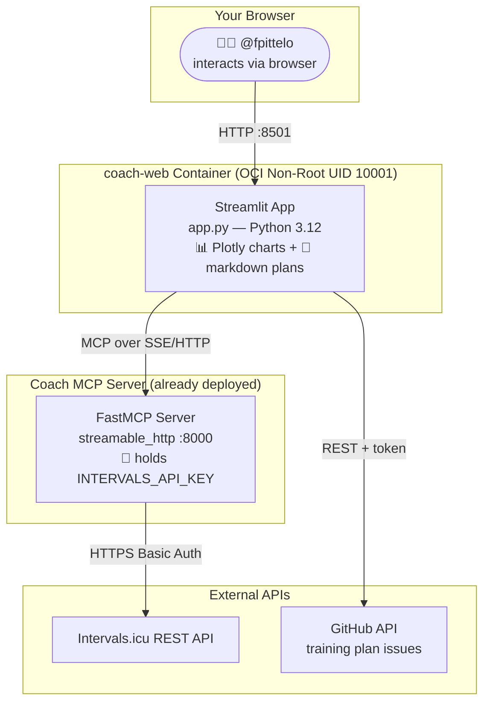
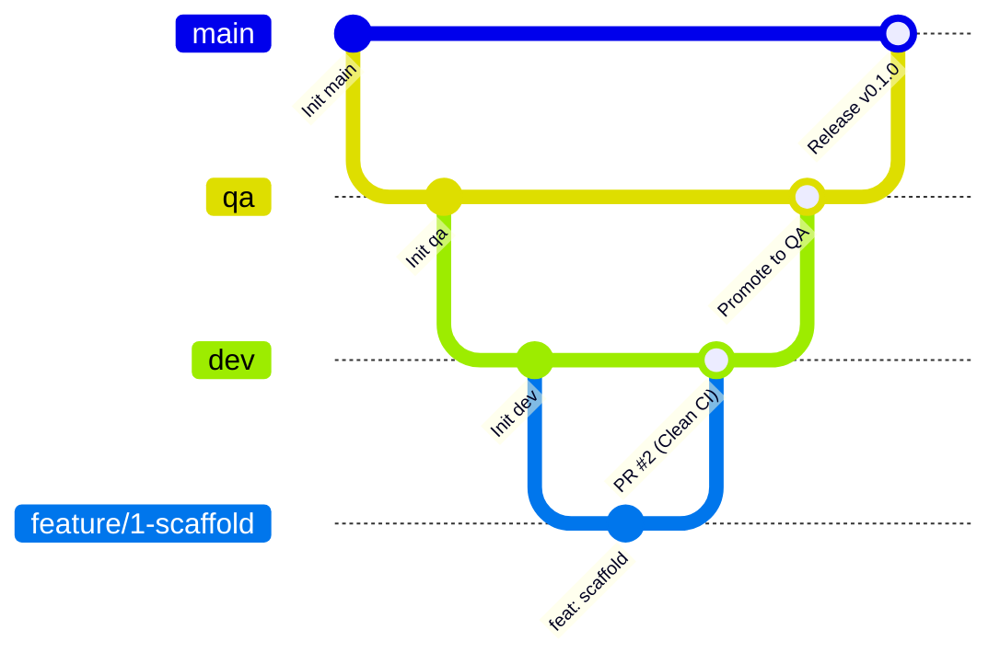

# 🚴‍♂️ Coach Web — Your Personal Endurance Cockpit

[](LICENSE.md)
[](https://www.python.org/downloads/)
[](https://streamlit.io)
[](https://modelcontextprotocol.io)
[-success.svg)](https://opencontainers.org)

> **Your coach talks. Your watts listen. Your body thanks you.**
>
> Coach Web is a Python-native Streamlit dashboard that turns your Intervals.icu biometric data into a live cockpit — and your weekly training plans into a story you can scroll, not a spreadsheet you dread.

---

## 🎯 What Is This?

Coach Web is the **interactive frontend** for the [Coach MCP server](https://github.com/fpittelo/coach) — a FastMCP server that exposes the Intervals.icu REST API to LLMs via the Model Context Protocol.

Instead of forcing you to dig through five tabs on Intervals.icu, Coach Web pulls the numbers that matter and puts them on one screen:

- **Live readiness dashboard** — FTP, resting HR, HRV, sleep, CTL/ATL/TSB at a glance
- **Biometric trends** — 42-day fitness bank, fatigue tank, and form battery charts
- **Weekly training plans** — the last 5 weeks + your current microcycle, rendered as beautiful markdown
- **Chat with your coach** — talk to the Coach MCP server through a built-in chat interface

All in your browser. All in Python. Zero JavaScript headaches.

---

## 🏛️ Architecture in a Nutshell



**Two containers. One language. Zero proxies.**

---

## 🚀 Quick Start

### Option 1: Local Dev (KIS)

```bash
# Clone
gh repo clone fpittelo/coach-web
cd coach-web

# Install with uv
uv venv && source .venv/bin/activate
uv pip install -e ".[dev]"

# Configure
cp .env.example .env
# Edit .env with your COACH_MCP_URL and GITHUB_TOKEN

# Run
streamlit run src/coach_web/app.py --server.port 8501
```

### Option 2: Docker

```bash
docker build -t coach-web .

docker run -d --rm -p 8501:8501 \
  -e COACH_MCP_URL="http://localhost:8000/mcp" \
  -e GITHUB_TOKEN="ghp_xxx" \
  --name coach-web-app \
  coach-web
```

Then open [http://localhost:8501](http://localhost:8501) and meet your coach.

---

## 📊 What You'll See

### Readiness Cockpit

| Metric | What it tells you |
|:---|:---|
| **FTP** | Your cycling power baseline (watts) — the anchor for every interval |
| **Resting HR** | Recovery quality — low = recovered, high = accumulated fatigue |
| **HRV (rMSSD)** | Nervous system readiness — higher = more parasympathetic = ready to train |
| **Sleep** | How much repair your body got last night |
| **CTL (Fitness)** | Your 42-day aerobic engine size — the bigger, the stronger |
| **ATL (Fatigue)** | Your 7-day acute load — the higher, the more tired you are right now |
| **TSB (Form)** | CTL minus ATL — negative = building, positive = tapering/peaking |

### Weekly Training Plans

The last 5 weeks + your current microcycle, pulled from GitHub issues (labels: `agent::coach`, `type::task`) and rendered as native markdown. Each week shows:
- Daily sessions with explicit wattage (HOME Rule #6 compliant — no % FTP)
- Duration, load (TSS), and Intervals.icu event IDs
- Execution tracking checklists

---

## 📖 Documentation

| Document | Audience |
|:---|:---|
| [User Guide](docs/user_guide.md) | @fpittelo — how to use the dashboard |
| [Admin Guide](docs/admin_guide.md) | @devops — deployment, Docker, env vars |
| [Specifications](docs/specifications.md) | @architect — technical specs, data flow, MCP integration |
| [Architecture](docs/architecture.md) | @architect — ArchiMate 3.x model, C4 diagrams, ADRs |

---

## 🔒 Security & Privacy

- **Swiss nLPD (FADP) Compliant** — all biometric data (HR, HRV, sleep, training loads) stays in ephemeral browser session. No persistent client-side storage.
- **No API Key in the Browser** — the Intervals.icu API key lives **only** in the Coach MCP server's environment. The web app never touches it.
- **OCI Non-Root Container** — runs as unprivileged user `coach-web` (`UID:GID 10001:10001`), same hardening as the Coach MCP server.
- **Clean stdout** — all logging goes to `stderr`; Streamlit manages the HTTP channel.

---

## 🧱 Tech Stack

| Layer | Technology |
|:---|:---|
| **Language** | Python 3.12 |
| **Framework** | Streamlit |
| **Charts** | Plotly (built into Streamlit) |
| **MCP Client** | `mcp[cli]` Python SDK (streamable_http transport) |
| **GitHub API** | `httpx` async client (for training plan issues) |
| **Validation** | Pydantic v2 |
| **Container** | `python:3.12-slim`, multi-stage, non-root UID 10001 |
| **CI/CD** | GitHub Actions: `ruff` + `mypy --strict` + `pytest` + Docker build |

---

## 🌳 Branching & Releases

Coach Web follows the [HOME Governance 3-branch lifecycle](https://github.com/fpittelo/coach):



- `dev` — active development integration
- `qa` — staging validation
- `main` — production release (`ghcr.io/fpittelo/coach-web:latest`)

---

## 📄 License

**GNU General Public License v3.0 or later (GPL-3.0-or-later)** — see [LICENSE.md](LICENSE.md).

Same license as the Coach MCP server. Open source, copyleft, built with love in Switzerland. 🇨🇭

---

## 🙌 Acknowledgements

- **[Intervals.icu](https://intervals.icu)** — the best endurance analytics platform on the planet
- **[Model Context Protocol](https://modelcontextprotocol.io)** — Anthropic's protocol for LLM-tool integration
- **[Streamlit](https://streamlit.io)** — the fastest way to build a data app in Python
- **[HOME SCRUM Team](https://github.com/fpittelo)** — @architect, @scrum-master, @developer, @devops, @cyber-security, @code-reviewer

---

> _Built by the HOME SCRUM Team for @fpittelo. Because watts don't lie, and neither should your dashboard._