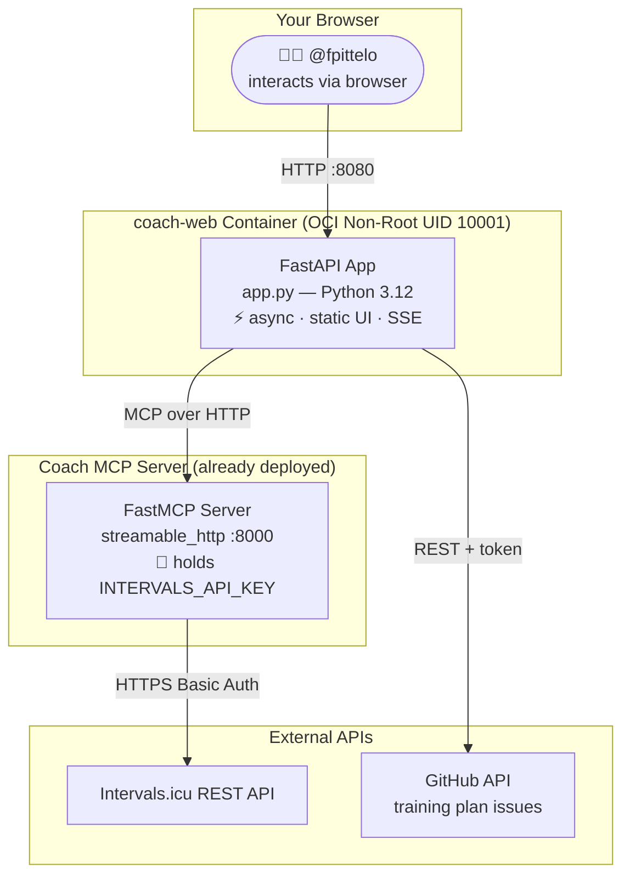
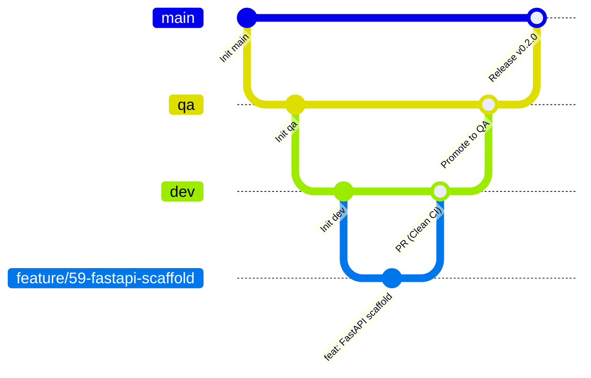

# 🚴‍♂️ Coach Web — Your Personal Endurance Cockpit

[](LICENSE.md)
[](https://www.python.org/downloads/)
[](https://fastapi.tiangolo.com)
[](https://modelcontextprotocol.io)
[-success.svg)](https://opencontainers.org)

> **Your coach talks. Your watts listen. Your body thanks you.**
>
> Coach Web is the Python-native FastAPI frontend for the Coach MCP server — turning your
> Intervals.icu biometric data into a live cockpit and your weekly training plans into a story
> you can scroll, not a spreadsheet you dread.

---

## 🎯 What Is This?

Coach Web is the **interactive frontend** for the [Coach MCP server](https://github.com/fpittelo/coach) — a FastMCP server that exposes the Intervals.icu REST API to LLMs via the Model Context Protocol.

Phase 1 (Local VIDAR Evolution) replaces the legacy Streamlit scaffold with an asynchronous
FastAPI core that serves a Swiss minimalist single-page interface (Alpine.js + Tailwind CSS)
and streams the agent pipeline over native Server-Sent Events.

The Phase 1 core delivers:

- **FastAPI application factory** with clean lifespan startup/shutdown
- **`GET /health` / `GET /healthz`** healthchecks (status, service, version, uptime)
- **Static asset serving** for the Swiss minimalist UI at `/static/`
- **Pydantic v2 settings** with `.env` loading
- **Dual MCP client hub**, OpenRouter agent loop and SSE streaming (upcoming issues)

---

## 🏛️ Architecture in a Nutshell



**Two containers. One language. Zero proxies.**

---

## 🚀 Quick Start

### Option 1: Local Dev (KIS)

```bash
# Clone
gh repo clone fpittelo/coach-web
cd coach-web

# Install with uv
uv sync

# Configure
cp .env.example .env
# Edit .env with your COACH_MCP_URL and GITHUB_TOKEN

# Run (FastAPI + uvicorn)
uv run coach-web
# or with autoreload
uv run uvicorn coach_web.app:create_app --factory --reload --port 8080
```

Then open [http://localhost:8080](http://localhost:8080) — the Swiss minimalist shell is served from `/`.

Healthcheck: [http://localhost:8080/health](http://localhost:8080/health)

### Option 2: Docker

```bash
docker build -t coach-web .

docker run -d --rm -p 8080:8080 \
  -e COACH_MCP_URL="http://localhost:8000/mcp" \
  -e GITHUB_TOKEN="ghp_xxx" \
  --name coach-web-app \
  coach-web
```

Then open [http://localhost:8080](http://localhost:8080) and meet your coach.

---

## 📊 What You'll See

### Readiness Cockpit

| Metric | What it tells you |
|:---|:---|
| **FTP** | Your cycling power baseline (watts) — the anchor for every interval |
| **Resting HR** | Recovery quality — low = recovered, high = accumulated fatigue |
| **HRV (rMSSD)** | Nervous system readiness — higher = more parasympathetic = ready to train |
| **Sleep** | How much repair your body got last night |
| **CTL (Fitness)** | Your 42-day aerobic engine size — the bigger, the stronger |
| **ATL (Fatigue)** | Your 7-day acute load — the higher, the more tired you are right now |
| **TSB (Form)** | CTL minus ATL — negative = building, positive = tapering/peaking |

### Weekly Training Plans

The last 5 weeks + your current microcycle, pulled from GitHub issues (labels: `agent::coach`, `type::task`) and rendered as native markdown. Each week shows:
- Daily sessions with explicit wattage (HOME Rule #6 compliant — no % FTP)
- Duration, load (TSS), and Intervals.icu event IDs
- Execution tracking checklists

---

## 📖 Documentation

| Document | Audience |
|:---|:---|
| [User Guide](docs/user_guide.md) | @fpittelo — how to use the dashboard |
| [Admin Guide](docs/admin_guide.md) | @devops — deployment, Docker, env vars |
| [Specifications](docs/specifications.md) | @architect — technical specs, data flow, MCP integration |
| [Architecture](docs/architecture.md) | @architect — ArchiMate 3.x model, C4 diagrams, ADRs |

> ℹ️ The `docs/` set is being refreshed by @architect for the Phase 1 FastAPI migration (ADR-01).

---

## 🔒 Security & Privacy

- **Swiss nLPD (FADP) Compliant** — all biometric data (HR, HRV, sleep, training loads) stays in ephemeral browser session. No persistent client-side storage.
- **No API Key in the Browser** — the Intervals.icu API key lives **only** in the Coach MCP server's environment. The web app never touches it.
- **OCI Non-Root Container** — runs as unprivileged user `coach-web` (`UID:GID 10001:10001`), same hardening as the Coach MCP server.
- **Clean stdout** — structured logging with no secrets logged.

---

## 🧱 Tech Stack

| Layer | Technology |
|:---|:---|
| **Language** | Python 3.12 |
| **Framework** | FastAPI + uvicorn |
| **Frontend** | Alpine.js + Tailwind CSS (static assets) |
| **Streaming** | Server-Sent Events (`sse-starlette`) |
| **MCP Client** | `mcp[cli]` Python SDK (streamable_http transport) |
| **GitHub API** | `httpx` async client (for training plan issues) |
| **Validation** | Pydantic v2 + `pydantic-settings` |
| **Container** | `python:3.12-slim`, multi-stage, non-root UID 10001 |
| **CI/CD** | GitHub Actions: `ruff` + `mypy --strict` + `pytest` + Docker build |

---

## 🌳 Branching & Releases

Coach Web follows the [HOME Governance 3-branch lifecycle](https://github.com/fpittelo/coach):



- `dev` — active development integration
- `qa` — staging validation
- `main` — production release (`ghcr.io/fpittelo/coach-web:latest`)

---

## 📄 License

**GNU General Public License v3.0 or later (GPL-3.0-or-later)** — see [LICENSE.md](LICENSE.md).

Same license as the Coach MCP server. Open source, copyleft, built with love in Switzerland. 🇨🇭

---

## 🙌 Acknowledgements

- **[Intervals.icu](https://intervals.icu)** — the best endurance analytics platform on the planet
- **[Model Context Protocol](https://modelcontextprotocol.io)** — Anthropic's protocol for LLM-tool integration
- **[FastAPI](https://fastapi.tiangolo.com)** — high-performance async Python web framework
- **[HOME SCRUM Team](https://github.com/fpittelo)** — @architect, @scrum-master, @developer, @devops, @cyber-security, @code-reviewer

---

> _Built by the HOME SCRUM Team for @fpittelo. Because watts don't lie, and neither should your dashboard._
