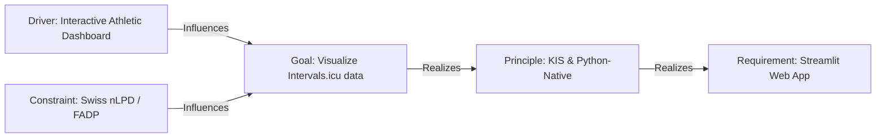
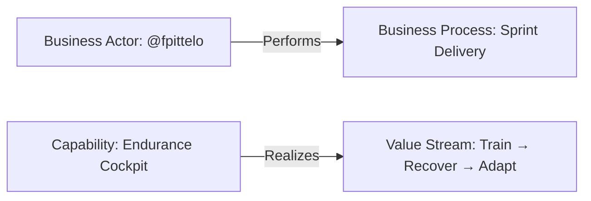
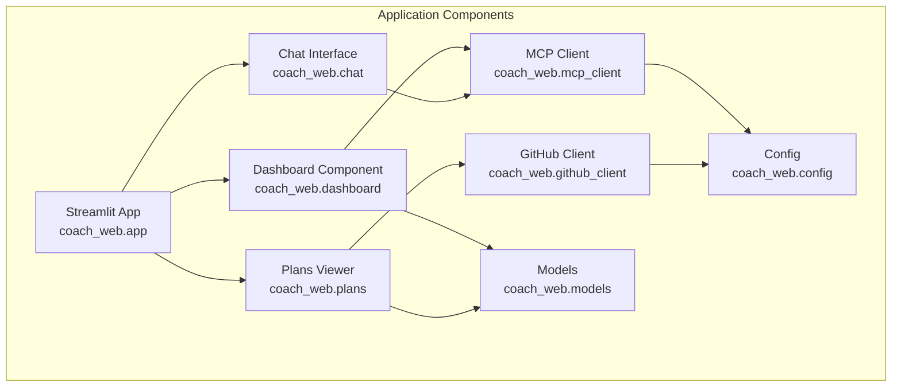
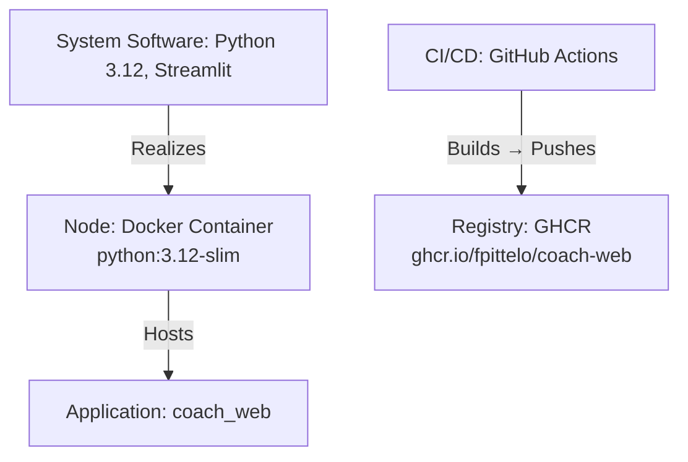
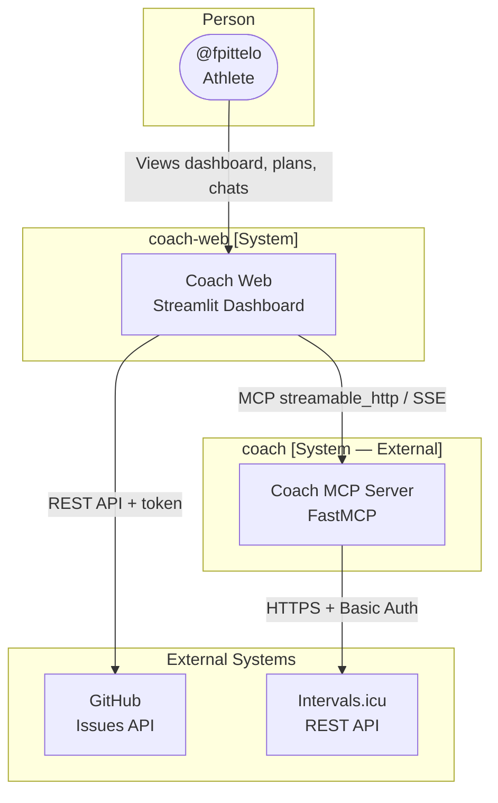
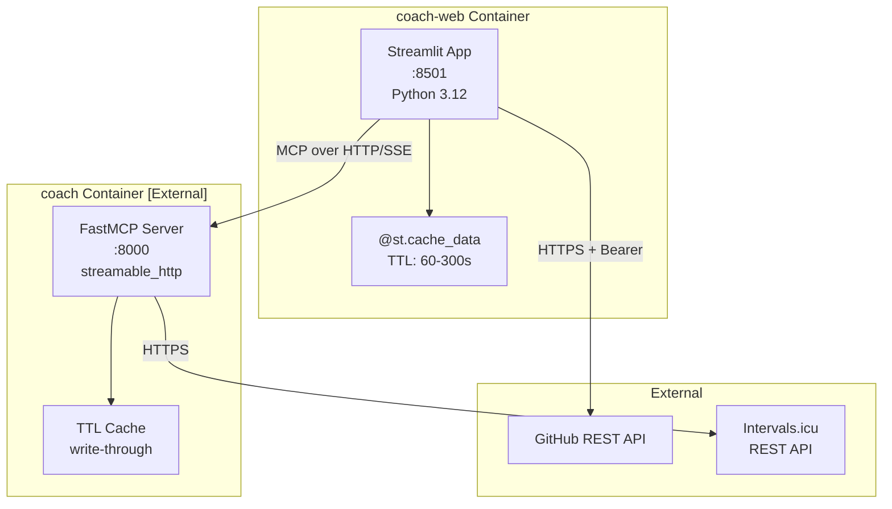
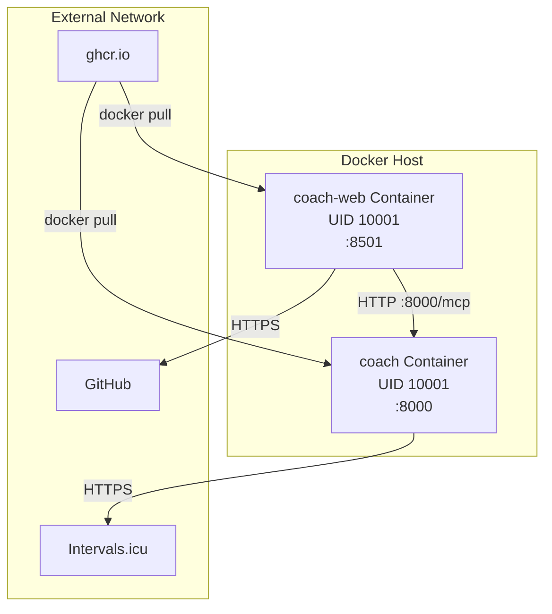
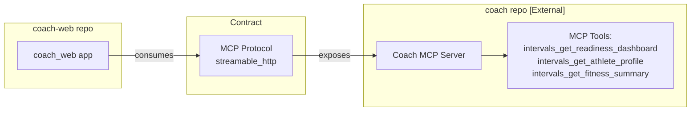

# 📕 Architecture — Coach Web

**Audience:** @architect, @devops  
**Last updated:** 2026-09-19

---

## 1. ArchiMate 3.x Metamodel

### Motivation Layer



### Business Layer



### Application Layer



### Technology Layer



---

## 2. C4 Model — System Context



---

## 3. C4 Model — Container View



---

## 4. Deployment Topology



---

## 5. ADR-001: Repository Separation

## ADR-001: Separate Repository for Coach Web

| Field | Value |
|:---|:---|
| **Status** | Accepted |
| **Date** | 2026-09-05 |
| **Deciders** | @architect, @scrum-master, @developer, @devops, @cyber-security |
| **Reviewed by** | @fpittelo |

### Context

The product owner (@fpittelo) requested a modern web application to interactively visualize Intervals.icu biometric data and display weekly training plans. The existing `fpittelo/coach` repository is a Python FastMCP server with a mature CI/CD pipeline (311 tests, 91% coverage, `ruff` + `mypy --strict` + `pytest` + Docker).

### Decision

**Create a separate repository `fpittelo/coach-web` for the web application.**

### Rationale

1. **Protocol Decoupling (@architect):** The web app is a *client* of the Coach MCP server, communicating over the MCP `streamable_http` transport. They share no runtime code. Repository boundaries mirror this runtime boundary.
2. **Sprint Independence (@scrum-master):** Frontend sprints (UI, UX, charts) have a different backlog shape than backend sprints (API tools, Intervals.icu integration). Separate repos preserve clean milestone tracking and velocity measurement.
3. **Tech Stack Divergence (@developer):** While both repos are Python, the web app uses Streamlit + Plotly + MCP client SDK, distinct from FastMCP + Pydantic + httpx server modules. Separate `pyproject.toml` files keep dependency trees clean.
4. **CI/CD Independence (@devops):** Separate GitHub Actions workflows, separate GHCR image registries (`ghcr.io/fpittelo/coach` vs `ghcr.io/fpittelo/coach-web`), independent release cadences. A frontend hotfix should not trigger a backend image rebuild.
5. **Security Boundary (@cyber-security):** The browser is an untrusted runtime for biometric data. Separate repos enforce a hard boundary between the hardened MCP backend (holds API key) and the web client (never touches the API key). Swiss nLPD/FADP data minimization is easier to enforce per-repo.
6. **KIS Principle (@fpittelo):** Apply Keep It Simple — one repo per deployable artifact, one language per repo, one CI pipeline per repo.

### Alternatives Considered

| Alternative | Pros | Cons | Verdict |
|:---|:---|:---|:---|
| **Monorepo** | Shared CI, one clone | Mixed toolchain, coupled releases, ambiguous rollback | ❌ Rejected |
| **Separate repo (chosen)** | Clean boundaries, independent releases, focused CI | Slight overhead (two repos) | ✅ Accepted |

### Consequences

- `coach` repo stays focused on MCP server development
- `coach-web` repo handles all frontend concerns
- Both repos independently follow the HOME 3-branch lifecycle (`dev` → `qa` → `main`)
- Both repos use the same Python 3.12 + `uv` + `ruff` + `mypy` + `pytest` quality gates
- Communication between repos is via the MCP protocol contract, not shared source code

---

## 6. ADR-002: Streamlit Framework Choice

| Field | Value |
|:---|:---|
| **Status** | Accepted (superseded in practice by the v0.5 FastAPI migration — see ADR-006 note) |
| **Date** | 2026-09-05 |
| **Deciders** | @architect, @developer, @fpittelo |

### Context

The web app needs to display interactive charts (Plotly), render markdown training plans, and provide a chat interface — all in Python.

### Decision

**Use Streamlit as the web framework.**

### Rationale
1. **KIS:** `streamlit run app.py` — one file, zero config, no frontend toolchain
2. **Python-native:** Stays in `uv`/`pip` ecosystem — no npm, no TypeScript
3. **Built-in charts:** `st.plotly_chart()` — no separate charting setup
4. **Markdown rendering:** `st.markdown()` renders training plan issues natively
5. **Chat UI:** `st.chat_message` + `st.chat_input` — built-in conversational interface
6. **Modern look:** Clean default UI, not a legacy admin panel
7. **MCP integration:** Compatible with the `mcp[cli]` Python SDK over `streamable_http`

### Alternatives Considered

| Alternative | Pros | Cons | Verdict |
|:---|:---|:---|:---|
| **NiceGUI** | Modern look, FastAPI-based | Quasar/Vue complexity under the hood | ❌ Rejected |
| **FastAPI + Jinja2 + HTMX** | More control | More boilerplate, manual UI polish | ❌ Rejected |
| **Gradio** | ML-focused | Optimized for ML demos, not dashboards | ❌ Rejected |
| **Streamlit (chosen)** | KIS, Python-native, built-in charts + chat | Limited customization (acceptable) | ✅ Accepted |

---

## 7. Repository Structure

```
fpittelo/coach-web/
├── .github/
│   └── workflows/
│       ├── ci.yaml           # Lint + test + Docker build validation
│       └── deploy.yaml       # GHCR image push (dev/qa/prod)
├── src/
│   └── coach_web/
│       ├── __init__.py
│       ├── app.py            # Streamlit entry point
│       ├── config.py         # Pydantic Settings
│       ├── mcp_client.py     # MCP SDK client wrapper
│       ├── github_client.py  # GitHub API client
│       ├── dashboard.py      # Readiness dashboard
│       ├── plans.py          # Weekly plan viewer
│       ├── chat.py           # Coach chat interface
│       └── models.py         # Pydantic v2 models
├── tests/
│   ├── __init__.py
│   ├── conftest.py
│   ├── test_config.py
│   ├── test_mcp_client.py
│   ├── test_github_client.py
│   ├── test_dashboard.py
│   ├── test_plans.py
│   └── test_chat.py
├── docs/
│   ├── user_guide.md         # End-user guide
│   ├── admin_guide.md        # Deployment & CI/CD
│   ├── specifications.md     # Technical specs
│   ├── architecture.md       # This file (ArchiMate + C4 + ADRs)
│   └── security.md           # Privacy & STRIDE
├── .env.example
├── .dockerignore
├── .gitignore
├── Dockerfile                # Multi-stage, non-root UID 10001
├── pyproject.toml            # Build + deps + tool config
├── LICENSE.md                # GPL-3.0-or-later
└── README.md
```

---

## 8. Cross-Repository Dependencies



**Contract:** The MCP protocol over `streamable_http` is the integration contract. The `coach-web` repo depends on the Coach MCP server's *published tool schema*, not its source code.

---

## 9. ADR-006: v0.7 Visual Contract Supersession

| Field | Value |
|:---|:---|
| **Status** | Accepted |
| **Date** | 2026-09-19 |
| **Deciders** | @architect, @developer, @scrum-master, @cyber-security |
| **Reviewed by** | @fpittelo |
| **Supersedes** | Sprint 03 Swiss minimalist visual contract (test-enforced, undocumented) |
| **Tracked in** | Epic #88 — Sprint 09 (v0.7.0), Milestone 9 |

### Context

Sprint 03 (v0.3.0) established a Swiss minimalist visual contract: a strict token set (`#111` ink, `#fff` paper, `#ff0000` accent, `--radius: 2px`, 1px hairline borders, no shadows, emoji-free Inter typography), enforced by contract tests in `tests/test_static_assets.py` (`test_stylesheet_uses_swiss_tokens` asserts the absence of shadows and large radii; `test_index_uses_text_interpolation_only` forbids `x-html` entirely).

The v0.7 UI/UX Overhaul epic (Sprint 09, #88 — groomed 2026-09-19 through a code-grounded technical grilling by @developer, 12 product decisions signed off by @fpittelo, and a KIS/YAGNI scope pass) requires a client-ready conversational experience that is incompatible with several clauses of that contract: softer radii and shadows, a slate/teal palette, a centered 760px single column, and sanitized markdown rendering of assistant messages (an intentional, gated reversal of the x-text-only posture).

### Decision

**Supersede the Sprint 03 visual contract with the v0.7 conversational design contract:**

1. **Design tokens:** off-white surfaces (`#F8FAFC`/`#FFFFFF`), ink `#1E293B`, muted ink `#475569`, hairline `#E2E8F0`, accent deep teal `#0F766E`, accent ink `#FFFFFF`; `--radius: 10px` (band 8–12px); soft shadow tokens replace harsh black hairline borders. Single centered column, `max-width: 760px`. Inter remains the sole typeface (self-hosted WOFF2, unchanged since Sprint 03).
2. **Deliberate test supersession:** `test_stylesheet_uses_swiss_tokens` is rewritten to assert the v0.7 token contract instead of forbidding shadows/radii. No test is deleted without a replacement assertion (zero-warning gate unchanged).
3. **Rendering posture (assistant-only):** assistant messages render `DOMPurify.sanitize(marked.parse(text))` via `x-html` — vendored, self-hosted, zero CDN. User messages remain `x-text` forever. `test_index_uses_text_interpolation_only` is rewritten to allow `x-html` only on assistant messages via the sanitizer helper. **This reversal is security-gated:** STRIDE review #87 (@cyber-security) must sign off before #81 merges.
4. **Transport & conversation:** `GET /api/agent/stream` is replaced by `POST /api/agent/stream` (Pydantic v2 body `{message, history}`; history capped at 10 entries; roles `user`/`assistant` only) — client-owned history, no server session store (nLPD ephemeral posture), and message content no longer leaks into access-log query strings (#79).
5. **Styling strategy:** hand-written CSS + design tokens. No Tailwind, no Node toolchain, no icon library (single inline SVG monogram). The KIS/YAGNI cut list and locked product decisions are recorded in epic #88.

### Rationale

1. **Client-ready quality bar (PO Q1):** the v0.3 contract reads as an internal prototype; the epic's conversational ergonomics (bubbles, inline plan cards, pinned composer, onboarding chips) require softer geometry and a focused reading column.
2. **Accessibility:** slate-on-off-white with a deep teal accent meets WCAG AA contrast; the 8–12px radius band + soft shadows is the epic's explicit visual direction (PO Q5).
3. **Security by gate, not by avoidance:** forbidding `x-html` entirely was the simplest v0.5 posture; the proportionate v0.7 posture is sanitization + STRIDE review + contract tests — enabling markdown value without exposing the browser to untrusted HTML (user input never renders as HTML; the plan card stays structured Pydantic→HTML).
4. **Privacy by design (Swiss nLPD):** POST transport removes message text from URLs; client-owned history keeps the server stateless and the browser session ephemeral.
5. **KIS/YAGNI:** only two new vendored assets (marked, DOMPurify); no frameworks, no build toolchain, no icon set; deliberate non-goals are recorded in epic #88.

### Alternatives Considered

| Alternative | Pros | Cons | Verdict |
|:---|:---|:---|:---|
| **Keep v0.3 contract, style around it** | Zero test churn | Blocks the epic's core visual goals; compliance theatre | ❌ Rejected |
| **Adopt Tailwind (vendored/CDN)** | Utility speed | Requires Node build or multi-KB CDN payload; contradicts zero-CDN and hand-written CSS; README claim already wrong | ❌ Rejected |
| **Server-side markdown rendering** | One render path | Template pipeline rework; plan approval needs raw JSON anyway; client-side sanitization is proportionate | ❌ Rejected |
| **v0.7 tokens + gated x-html (chosen)** | Epic goals met; security-gated; minimal asset footprint | Requires deliberate test rewrites (this ADR) and STRIDE review | ✅ Accepted |

### Consequences

- `tests/test_static_assets.py` contract tests are rewritten per this ADR in #78 and #81 — test supersession is explicit, reviewed, and logged; never silent deletion.
- #81 is merge-blocked on STRIDE sign-off (#87): sanitizer configuration, mid-stream partial renders, CSP posture (including the Alpine `unsafe-eval` question), and replayed-history prompt injection.
- `README.md` tech-stack table is corrected in #78: the repo uses hand-written CSS, not Tailwind.
- Sections 1–8 of this document still describe the retired Streamlit architecture (ADR-002) and are slated for a full refresh; **ADR-006 is authoritative for the visual/rendering contract going forward.**
- The v0.3 Inter typography decision (self-hosted WOFF2, zero CDN) carries forward unchanged.

---

_Last updated: 2026-09-19_
