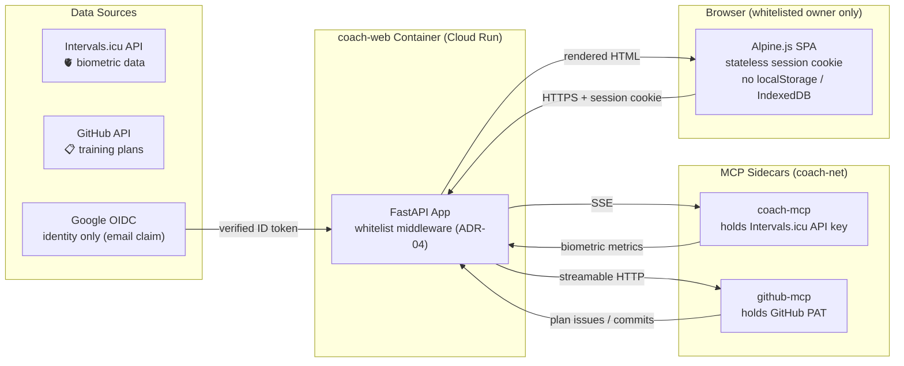

# 🔒 Security & Privacy Policy

## Swiss nLPD (FADP) Compliance

Coach Web processes **biometric and health-related personal data** (resting heart rate, HRV, sleep duration, training load metrics) originating from the Intervals.icu API.

This data is subject to the **Swiss Federal Act on Data Protection (nLPD / FADP)** and the **Cantonal (CH-VD)** data protection regulations.

---

## Access-Control Boundary (ADR-04, issue #65)

**The email whitelist IS the access-control boundary.** The Cloud Run edge accepts unauthenticated traffic by design (scale-to-zero, `allUsers` invoker at $0 fixed cost); all enforcement happens at the application level:

- **Google OIDC authorization-code flow** (`/auth/login` → `/auth/callback`): ID tokens are verified as RS256 against the Google JWKS with pinned issuer (both documented Google `iss` forms accepted), pinned audience, single-use nonce binding and a mandatory `email_verified` claim.
- **Whitelist enforcement**: only emails in `AUTH_WHITELIST_EMAILS` (default: `frederic.pitteloud@gmail.com`) may obtain a session — checked at login **and** re-checked on every authenticated request (403 otherwise). An empty whitelist rejects everyone (fail closed).
- **Stateless sessions**: short-lived HS256 JWTs (`iss=coach-web`, `aud=coach-web`, ≥32-byte key) carried in an `HttpOnly; Secure; SameSite=Lax` cookie. No server-side session store — compatible with scale-to-zero.
- **Fail-closed configuration**: `AUTH_ENABLED=true` without client credentials or with a short session secret refuses to boot. Auth is opt-in (`AUTH_ENABLED=false` locally, default).
- **Logout CSRF safety**: `/auth/logout` is POST-only (GET returns 405).

### Data Flow & Minimization

### Key Principles

| Principle | Implementation |
|:---|:---|
| **Data minimization** | Only pertinent metrics are fetched (FTP, HR, HRV, CTL/ATL/TSB, sleep) |
| **Purpose limitation** | Data is used solely for athletic coaching and training visualization |
| **Ephemeral storage** | No persistent client-side storage. No `localStorage`, no `IndexedDB`; the only cookies are the short-lived session and OIDC-state cookies (identity binding, never biometric data) |
| **Single-tenant** | The whitelist admits exactly one Google account; no roles, no multi-user model |

---

## Secret Boundaries

| Secret | Location | Never in |
|:---|:---|:---|
| `INTERVALS_API_KEY` | coach-mcp sidecar env | coach-web app, browser, logs |
| `GITHUB_TOKEN` | coach-web env → github-mcp sidecar | browser, logs |
| `OPENROUTER_API_KEY` | coach-web env (Secret Manager on Cloud Run) | browser, logs |
| `GOOGLE_OIDC_CLIENT_SECRET` | coach-web env (Secret Manager on Cloud Run) | browser, logs, repository |
| `AUTH_SESSION_SECRET` | coach-web env (≥32 bytes) | browser, logs, repository |

Secrets are injected via environment variables (Secret Manager on Cloud Run) and are never logged or persisted by the application.

---

## GitHub Token Scope

The web app uses a GitHub Personal Access Token (`GITHUB_TOKEN`) to fetch training plan issues from, and commit approved plan Markdown to, the `fpittelo/coach` repository (via the github-mcp sidecar).

**Required scope:** `repo:read` (or `public_repo` if the repo is public); plan approval additionally writes to the configured plan branch.

The token is passed via environment variable and **never** exposed to the browser client.

---

## Container Hardening

- **Non-root execution**: Runs as unprivileged user `coach-web` (`UID:GID 10001:10001`)
- **Multi-stage build**: Final image contains only runtime dependencies, no build tools
- **Minimal base image**: `python:3.12-slim` (Debian slim, not full)
- **No shell access**: `ENTRYPOINT` runs `uvicorn coach_web.app:create_app --factory`, not `/bin/bash`
- **Read-only filesystem**: Container filesystem mounted read-only where possible

---

## STRIDE Threat Model

| Threat | Vector | Mitigation |
|:---|:---|:---|
| **Spoofing** | Forged identity accessing the dashboard or API | Google OIDC RS256 ID-token verification (JWKS, pinned issuer/audience, single-use nonce); **the email whitelist is the access-control boundary (ADR-04)** — non-whitelisted identities receive 403 at login and on every request |
| **Tampering** | Cookie/API tampering, XSS | Stateless HS256-signed session cookies (`HttpOnly; Secure; SameSite=Lax`, audience-pinned `aud=coach-web`); Alpine.js escapes interpolated data; no raw-HTML rendering of user-controlled content |
| **Repudiation** | Owner denies a state-changing action | `/api/plan/approve` **is state-changing**: it schedules workouts on Intervals.icu and commits plan Markdown to GitHub. Mitigations: single whitelisted identity; GitHub commit history and Intervals.icu workout records form an external audit trail; structured application logs |
| **Information Disclosure** | Biometric data leakage | Data is rendered only inside a whitelisted session; secrets are env-only; no client-side persistence; Google receives only the OAuth identity exchange (no biometric data) |
| **Denial of Service** | Request floods, upstream stalls | Cloud Run scale-to-zero with max-instances cap; upstream timeouts (OpenRouter, MCP sidecars, Google endpoints); agent tool-iteration cap (`AGENT_MAX_TOOL_ITERATIONS`) |
| **Elevation of Privilege** | API key / secret extraction, session misuse | Intervals.icu API key lives only in the coach-mcp sidecar; session JWTs are audience-pinned so a reused signing key elsewhere cannot mint coach-web sessions; the whitelist is re-checked on every request; OIDC state cookie is single-use and cleared on every callback exit |

---

## Dependency Vulnerability Scanning

- **Python**: `pip-audit --strict` runs in CI (`ci.yaml`)
- **Docker**: Image built & validated in CI; scan via `trivy` or GitHub Security tab (planned)
- **Secrets**: `gitleaks` scans all commits for leaked credentials (`ci.yaml`)

---

## Compliance Checklist

- [x] No biometric data stored persistently in the browser
- [x] No API key exposed to the client side
- [x] Non-root container execution
- [x] Minimal data fetching (pertinent metrics only)
- [x] Google OIDC whitelist authentication enforced at application level (ADR-04, #65)
- [x] Stateless sessions — no server-side session store (scale-to-zero compatible)
- [x] Fail-closed auth configuration (refuses to boot misconfigured)

---

## Related Documents

| Document | Owner | Content |
|:---|:---|:---|
| [Architecture](architecture.md) | @architect | ArchiMate model, C4 diagrams, ADRs |
| [Admin Guide](admin_guide.md) | @fpittelo | Operations & configuration |

---

_Last updated: 2026-09-20_
