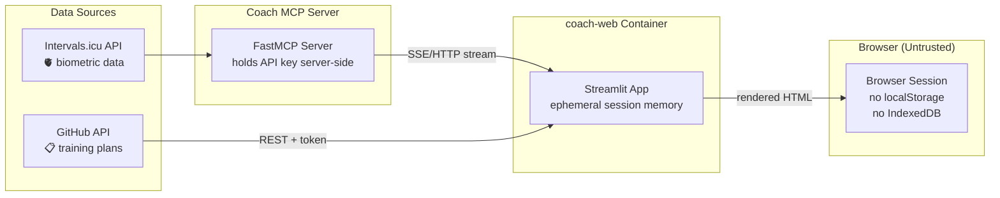

# 🔒 Security & Privacy Policy

## Swiss nLPD (FADP) Compliance

Coach Web processes **biometric and health-related personal data** (resting heart rate, HRV, sleep duration, training load metrics) originating from the Intervals.icu API.

This data is subject to the **Swiss Federal Act on Data Protection (nLPD / FADP)** and the **Cantonal (CH-VD)** data protection regulations.

---

## Data Flow & Minimization

### Key Principles

| Principle | Implementation |
|:---|:---|
| **Data minimization** | Only pertinent metrics are fetched (FTP, HR, HRV, CTL/ATL/TSB, sleep) |
| **Purpose limitation** | Data is used solely for athletic coaching and training visualization |
| **Ephemeral storage** | No persistent client-side storage. No `localStorage`, no `IndexedDB`, no cookies for biometric data |
| **No data export** | The web app does not write biometric data to disk, database, or external services |

---

## API Key Boundary

The Intervals.icu API key (`INTERVALS_API_KEY`) lives **only** in the Coach MCP server's environment variables. The web app **never** has access to it.

| Component | Has API Key? | Accesses Intervals.icu? |
|:---|:---|:---|
| Coach MCP Server | ✅ (env var) | ✅ (direct HTTPS) |
| coach-web Streamlit | ❌ (never) | ❌ (only via MCP) |
| Browser | ❌ (never) | ❌ (never) |

The web app calls the Coach MCP server over `streamable_http`. The MCP server proxies all Intervals.icu requests and returns structured data. The API key never crosses the container boundary.

---

## GitHub Token Scope

The web app uses a GitHub Personal Access Token (`GITHUB_TOKEN`) to fetch training plan issues from the `fpittelo/coach` repository.

**Required scope:** `repo:read` (or `public_repo` if the repo is public)

The token is passed via environment variable and **never** exposed to the browser client.

---

## Container Hardening

- **Non-root execution**: Runs as unprivileged user `coach-web` (`UID:GID 10001:10001`)
- **Multi-stage build**: Final image contains only runtime dependencies, no build tools
- **Minimal base image**: `python:3.12-slim` (Debian slim, not full)
- **No shell access**: `ENTRYPOINT` runs `streamlit run`, not `/bin/bash`
- **Read-only filesystem**: Container filesystem mounted read-only where possible

---

## STRIDE Threat Model (Summary)

| Threat | Vector | Mitigation |
|:---|:---|:---|
| **Spoofing** | Fake user accessing dashboard | Network isolation (localhost or private network) |
| **Tampering** | DOM manipulation / XSS | Streamlit framework sanitizes all rendered HTML; no `st.markdown(unsafe_allow_html=True)` for user-controlled content |
| **Repudiation** | User denies actions | N/A — no state-changing operations (read-only dashboard) |
| **Information Disclosure** | Biometric data in browser cache | No `localStorage`/`IndexedDB` usage; ephemeral Streamlit session |
| **Denial of Service** | Excessive requests to MCP server | Streamlit `@st.cache_data(ttl=60)` rate-limits upstream calls |
| **Elevation of Privilege** | API key extraction | API key is never in the web app's environment |

---

## Dependency Vulnerability Scanning

- **Python**: `pip-audit --strict` runs in CI (`ci.yaml`)
- **Docker**: Image scanned via `trivy` or GitHub Security tab (future Sprint 02)
- **Secrets**: `gitleaks` scans all commits for leaked credentials (future Sprint 02)

---

## Compliance Checklist

- [x] No biometric data stored persistently in the browser
- [x] No API key exposed to the client side
- [x] Non-root container execution
- [x] Minimal data fetching (pertinent metrics only)
|:---|:---|
| [Architecture](docs/architecture.md) | @architect — ArchiMate model, C4 diagrams, ADRs |

---

_Last updated: 2026-09-05_