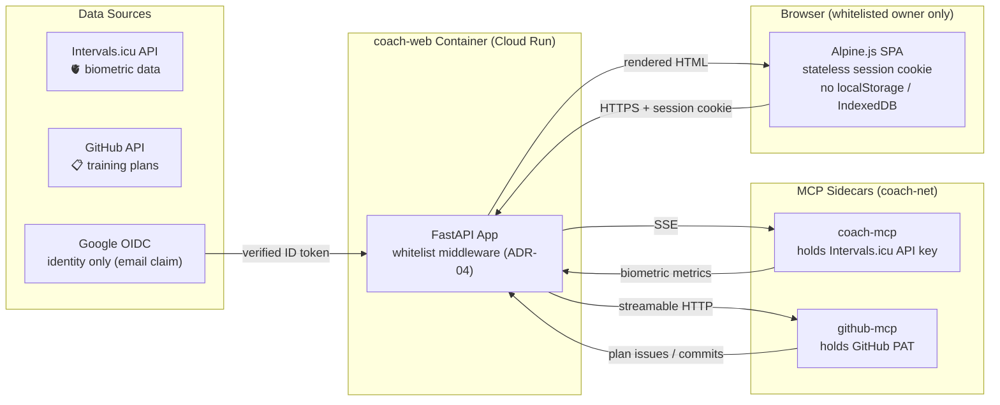
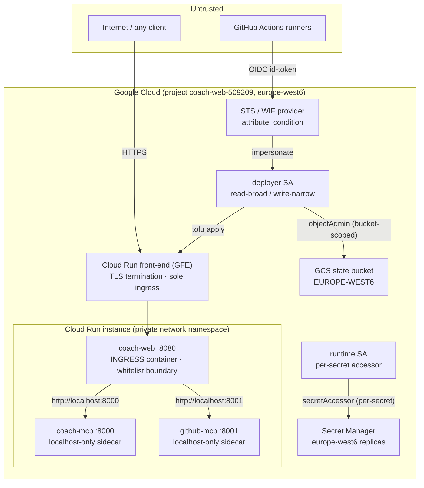

# 🔒 Security & Privacy Policy

## Swiss nLPD (FADP) Compliance

Coach Web processes **biometric and health-related personal data** (resting heart rate, HRV, sleep duration, training load metrics) originating from the Intervals.icu API.

This data is subject to the **Swiss Federal Act on Data Protection (nLPD / FADP)** and the **Cantonal (CH-VD)** data protection regulations.

All data-bearing resources of the v0.6.0 serverless topology are pinned to **`europe-west6` (Zürich)** — see the [nLPD Compliance Checklist](#nlpd-compliance-checklist) below.

---

## Access-Control Boundary (ADR-04, issue #65)

**The email whitelist IS the access-control boundary.** The Cloud Run edge accepts unauthenticated traffic by design (scale-to-zero, `allUsers` invoker at $0 fixed cost); all enforcement happens at the application level:

- **Google OIDC authorization-code flow** (`/auth/login` → `/auth/callback`): ID tokens are verified as RS256 against the Google JWKS with pinned issuer (both documented Google `iss` forms accepted), pinned audience, single-use nonce binding and a mandatory `email_verified` claim.
- **Whitelist enforcement**: only emails in `AUTH_WHITELIST_EMAILS` (default: `frederic.pitteloud@gmail.com`) may obtain a session — checked at login **and** re-checked on every authenticated request (403 otherwise). An empty whitelist rejects everyone (fail closed).
- **Stateless sessions**: short-lived HS256 JWTs (`iss=coach-web`, `aud=coach-web`, ≥32-byte key) carried in an `HttpOnly; Secure; SameSite=Lax` cookie. No server-side session store — compatible with scale-to-zero.
- **Fail-closed configuration**: `AUTH_ENABLED=true` without client credentials or with a short session secret refuses to boot. Auth is opt-in (`AUTH_ENABLED=false` locally, default).
- **Logout CSRF safety**: `/auth/logout` is POST-only (GET returns 405).

### Data Flow & Minimization

### Key Principles

| Principle | Implementation |
|:---|:---|
| **Data minimization** | Only pertinent metrics are fetched (FTP, HR, HRV, CTL/ATL/TSB, sleep) |
| **Purpose limitation** | Data is used solely for athletic coaching and training visualization |
| **Ephemeral storage** | No persistent client-side storage. No `localStorage`, no `IndexedDB`; the only cookies are the short-lived session and OIDC-state cookies (identity binding, never biometric data) |
| **Single-tenant** | The whitelist admits exactly one Google account; no roles, no multi-user model |

---

## Secret Boundaries

| Secret | Location | Never in |
|:---|:---|:---|
| `INTERVALS_API_KEY` | coach-mcp sidecar env (Secret Manager) | coach-web app, browser, logs |
| `GITHUB_TOKEN` | coach-web env → github-mcp sidecar (Secret Manager) | browser, logs |
| `OPENROUTER_API_KEY` | coach-web env (Secret Manager on Cloud Run) | browser, logs |
| `GOOGLE_OIDC_CLIENT_SECRET` | coach-web env (Secret Manager on Cloud Run) | browser, logs, repository |
| `AUTH_SESSION_SECRET` | coach-web env (≥32 bytes, Secret Manager on Cloud Run) | browser, logs, repository |

Secrets are injected via environment variables (Secret Manager on Cloud Run) and are never logged or persisted by the application. **IaC manages secret metadata and IAM only — secret versions are populated out-of-band, so no secret material ever reaches OpenTofu state** (`infra/modules/cloud-run/main.tf`).

---

## GitHub Token Scope

The web app uses a GitHub Personal Access Token (`GITHUB_TOKEN`) to fetch training plan issues from, and commit approved plan Markdown to, the `fpittelo/coach` repository (via the github-mcp sidecar).

**Required scope:** `repo:read` (or `public_repo` if the repo is public); plan approval additionally writes to the configured plan branch.

The token is passed via environment variable and **never** exposed to the browser client.

---

## Container Hardening

- **Non-root execution**: Runs as unprivileged user `coach-web` (`UID:GID 10001:10001`)
- **Multi-stage build**: Final image contains only runtime dependencies, no build tools
- **Minimal base image**: `python:3.12-slim` (Debian slim, not full)
- **No shell access**: `ENTRYPOINT` runs `uvicorn coach_web.app:create_app --factory`, not `/bin/bash`
- **Read-only filesystem**: Container filesystem mounted read-only where possible

---

## STRIDE Threat Model — Cloud Topology (v0.6.0, issue #68)

The v0.6.0 release moved the application from a single-container local compose topology to a **serverless multi-container Cloud Run service in `europe-west6`** fronted by an unauthenticated edge, with keyless CI federation and Secret Manager. This section is the authoritative STRIDE analysis of that cloud topology; the table below is the per-boundary summary.

### Trust Boundaries

### Boundary 1 — CI → GCP: Workload Identity Federation (keyless)

| STRIDE | Threat | Mitigation |
|:---|:---|:---|
| **Spoofing** | A foreign GitHub repository or a PR from a fork impersonates the CI deployer | `attribute_condition` pins **both** repository and ref before any IAM evaluation: `assertion.repository == "fpittelo/coach-web"` AND (`refs/heads/dev` ∥ `refs/heads/qa` ∥ `refs/heads/main` ∥ `refs/tags/v*`). `refs/pull/*`, feature branches and non-`v` tags are rejected at the **STS token exchange**. `allowed_audiences` is pinned to `https://github.com/fpittelo`; the deployer SA binding uses a repo-scoped `principalSet` (`attribute.repository/fpittelo/coach-web`), not a wildcard. |
| **Elevation of Privilege** | CI mints long-lived credentials | **No service-account keys exist anywhere** — federation only (ADR-06). The deployer is **read-broad / write-narrow**: project READ via `roles/viewer` + `roles/iam.securityReviewer` (both zero-write, needed by `tofu apply`'s refresh phase), while writes stay narrow (`roles/run.admin`, SA-scoped `serviceAccountUser`, bucket-scoped `storage.objectAdmin`). The deployer deliberately holds **no** `secretmanager.secretAccessor` — it never reads secret values. |
| **Tampering** | A compromised workflow deploys an arbitrary image | Deploys are digest-pinned (`ghcr.io/...@sha256:...`) and the production deploy environment is gated on explicit PO approval. |

### Boundary 2 — Internet → Cloud Run: unauthenticated edge

| STRIDE | Threat | Mitigation |
|:---|:---|:---|
| **Spoofing** | Anonymous access to dashboard/API | `INGRESS_TRAFFIC_ALL` + `allUsers` invoker is **only** acceptable because ADR-04 makes the **application-level Google OIDC email whitelist the access-control boundary** (`infra/modules/cloud-run/main.tf`, carried review item #2 from #64). The edge is a transport door, not an authorization decision. Default-deny middleware protects every path except `PUBLIC_PATHS = {/ , /health, /healthz}` and `PUBLIC_PREFIXES = (/static/, /auth/)`; `/api/*` returns **401** without a valid session, and a non-whitelisted identity gets **403** on every request. |
| **Elevation of Privilege** | Path traversal to reach a public path | `is_public_path()` normalizes the raw ASGI path with `posixpath.normpath` and fails closed on any residual `..` segment, so `/static/../api/...` cannot be classified public. |

### Boundary 3 — GFE → uvicorn: proxy-header trust

`uvicorn` runs with `--proxy-headers --forwarded-allow-ips='*'` (Dockerfile line 73). This is **safe for the Cloud Run topology** and topology-dependent in general:

- The Cloud Run front-end (GFE) is the **sole ingress path** (even with `INGRESS_TRAFFIC_ALL`, traffic routes through the front-end) and **always sets/overwrites `X-Forwarded-Proto`**. Trusting it is what makes the app derive `https` URLs and keeps the OIDC `redirect_uri` correct (live incident: redirect_uri mismatch, PR #100).
- **Caveat (review 5260511893, PR #100):** the trust is **topology-dependent**. If this image were ever published on a non-loopback interface (`docker run -p 0.0.0.0:8000:8000`) or placed behind a proxy that does not sanitize `X-Forwarded-*`, a client could spoof the scheme. Local compose binds `127.0.0.1` only, so the local surface is loopback-only. **Any future change to the ingress topology must re-validate this flag in the same change.**
- `--forwarded-allow-ips` also broadens trust of `X-Forwarded-For` → `scope["client"]`; the app makes **no security decision on client IP** (no `request.client` / `scope["client"]` usage in `src/` — the boundary is the email whitelist), so there is no impact today.

### Boundary 4 — Runtime SA → Secret Manager

Per-secret IAM (`roles/secretmanager.secretAccessor` bound to each secret individually) replaces the former project-level grant (carried review item #1 from #64): the runtime SA can read **exactly the five secrets this stack defines and nothing else**. Replication is **user-managed, pinned to `europe-west6`** — automatic replication would spread health-data access tokens across Google-managed regions (nLPD). No secret version is ever managed by or stored in IaC/state.

### Boundary 5 — coach-web → sidecars: localhost-only

Cloud Run sidecars share the instance's network namespace; `coach-mcp :8000` and `github-mcp :8001` are reachable **only over `http://localhost`**. Sidecars must **not** declare a `ports` block (Cloud Run v2 permits exactly one exposed port — the main ingress container; declaring one is an API-level validation failure, live incidents #66/#96). Sidecar startup probes use **TCP socket probes**, never HTTP:

- `coach-mcp` serves **SSE (`/sse`)**; an HTTP probe would never complete (the stream stays open) and each aborted probe tears the instance down (live incident #66). A TCP probe proves the listener is up without touching the stream.
- `github-mcp` exposes no plain HTTP health endpoint; TCP is the closest safe equivalent.

**Consequence:** the SSE endpoint is **not exposed at the edge** — only the ingress container's port 8080 is routable from outside; `/api/agent/stream` on 8080 is session-gated and re-checked by the whitelist middleware.

### Boundary 6 — Browser → app: session & OIDC state

| STRIDE | Threat | Mitigation |
|:---|:---|:---|
| **Tampering** | Forged/edited session cookie | HS256 JWT with a **≥32-byte** secret (RFC 7518, enforced at boot: `validate_auth_config` raises `AuthConfigError` otherwise); decode pins `algorithms=["HS256"]`, `issuer=coach-web`, `audience=coach-web`, and **requires** `exp`, `iat`, `sub`, `aud`, `email`. A per-token **`jti`** is minted for traceability. `HttpOnly; Secure; SameSite=Lax`. |
| **Spoofing (CSRF/state)** | Login-CSRF / replayed OIDC state | `state = secrets.token_urlsafe(32)` doubles as the ID-token **nonce**; it is bound to a `cw_oidc_state` cookie (`HttpOnly; Secure; SameSite=Lax`, TTL 600 s) and compared with `secrets.compare_digest`. The cookie is **deleted on every callback exit — success and failure** (`_state_cleared`), preserving the single-use guarantee. ID tokens are verified RS256 against the Google JWKS with `kid` lookup, pinned `aud`/`iss`, `email_verified is True`, and nonce match. |
| **Spoofing (logout CSRF)** | Third-party page force-logs-out the owner | `/auth/logout` is **POST-only** (GET → 405). |
| **Information Disclosure** | Session/biometric data leaking to the client | No `localStorage`/`IndexedDB`; cookies carry identity only, never biometric data; error responses are sanitized JSON (`{"detail": ...}`) with no secrets or stack traces. |

### Boundary 7 — Plan approval: repudiation

`POST /api/plan/approve` **is state-changing**: it schedules workouts on Intervals.icu and commits plan Markdown to GitHub. Repudiation is mitigated by a **three-way external audit trail**:

1. **GitHub commit history** — every approved plan is a signed-by-attribution commit in `fpittelo/coach`.
2. **Intervals.icu workout records** — scheduled workouts are queryable in the athlete's calendar.
3. **Structured application logs** — Cloud Logging entries (the runtime SA has `roles/logging.logWriter`), with secrets never logged.

Because a single whitelisted identity is admitted, any approval is attributable to the owner by construction. **Residual:** the boundary is enforced by the session cookie; an unattended unlocked browser could approve on the owner's behalf. This is accepted for a single-tenant personal app and is a PO-checklist item (session TTL is bounded — app default `AUTH_SESSION_TTL_SECONDS=3600`).

### Boundary 8 — Denial of Service & cost

| STRIDE | Threat | Mitigation |
|:---|:---|:---|
| **Denial of Service** | Request floods / upstream stalls / instance teardown | `minScale=0`, `maxScale=2` bounds blast radius and cost; upstream timeouts (OpenRouter, MCP sidecars, Google endpoints, `HTTP_TIMEOUT_SECONDS=30`); agent tool-iteration cap (`AGENT_MAX_TOOL_ITERATIONS`); graceful exception handling. Scale-to-zero also caps the *cost* of a flood to the request-driven price only. |

---

## Cloud STRIDE Summary Table

| STRIDE | Primary vector (cloud topology) | Mitigation (anchor) |
|:---|:---|:---|
| **Spoofing** | Foreign repo/ref federating into GCP; anonymous edge access; forged session | WIF `attribute_condition` (repo + ref) + pinned `allowed_audiences`; app-level OIDC whitelist **is** the boundary (ADR-04); HS256 session with pinned iss/aud and required claims; OIDC state/nonce single-use |
| **Tampering** | Cookie/API tampering; arbitrary CI image; spoofed `X-Forwarded-*` | HS256 signature + `algorithms=[...]` pinning; digest-pinned images + gated prod deploy; GFE sole-ingress proxy-header trust (topology-dependent, caveat recorded) |
| **Repudiation** | Owner denies an approval | GitHub commits + Intervals.icu records + structured logs; single whitelisted identity |
| **Information Disclosure** | Biometric data / credential leakage | Data rendered only inside a whitelisted session; secrets env-only via Secret Manager; sanitized errors; no client persistence; per-secret IAM; europe-west6 replication |
| **Denial of Service** | Floods, upstream stalls, SSE probe teardown | `minScale=0`/`maxScale=2`; timeouts; tool-iteration cap; TCP (not HTTP) sidecar probes |
| **Elevation of Privilege** | Secret extraction; path traversal; over-broad CI identity | Per-secret `secretAccessor` (no project-level grant); default-deny path normalization; read-broad/write-narrow deployer with no secret access; non-root container |

---

## Dependency Vulnerability Scanning

- **Python**: `pip-audit --strict` runs in CI (`ci.yaml`) — verified green on `main` (run 35512358319 / jobs 106082347692)
- **Docker**: Image built & validated in CI; scan via `trivy` or GitHub Security tab (planned)
- **Secrets**: `gitleaks` scans all commits for leaked credentials (`ci.yaml`) — verified green on `main` (job 106082347801)

---

## nLPD Compliance Checklist

| # | Requirement | Status | Evidence |
|:---|:---|:---|:---|
| 1 | All data-bearing resources in `europe-west6` | ✅ | Cloud Run `location=europe-west6`; Secret Manager user-managed replicas `europe-west6` (×5); GCS state bucket `EUROPE-WEST6`; VPC subnet `europe-west6` |
| 2 | Health/biometric data processed in-region | ✅ | Intervals.icu metrics flow through `coach-mcp` inside the `europe-west6` Cloud Run instance; no cross-region storage |
| 3 | Access control = OIDC + whitelist | ✅ | Google OIDC (RS256, pinned iss/aud, nonce) + `AUTH_WHITELIST_EMAILS`, re-checked every request (403); fail-closed boot |
| 4 | Audit trail available | ✅ | Cloud Audit Logs + Cloud Logging (`roles/logging.logWriter`); GitHub commit history; Intervals.icu records; GCS state versioning |
| 5 | Data minimization | ✅ | Pertinent metrics only; no client-side persistence; secrets never logged |
| 6 | Encryption in transit | ✅ | HTTPS/TLS terminated at the GFE; Google APIs over HTTPS |
| 7 | Encryption at rest | ✅ | Google-managed encryption for Secret Manager, GCS, Cloud Run |
| 8 | No persistent browser storage of personal data | ✅ | No `localStorage`/`IndexedDB`; identity-only cookies |

---

## Compliance Checklist

- [x] No biometric data stored persistently in the browser
- [x] No API key exposed to the client side
- [x] Non-root container execution
- [x] Minimal data fetching (pertinent metrics only)
- [x] Google OIDC whitelist authentication enforced at application level (ADR-04, #65)
- [x] Stateless sessions — no server-side session store (scale-to-zero compatible)
- [x] Fail-closed auth configuration (refuses to boot misconfigured)
- [x] Keyless CI (WIF, no service-account keys) with repo+ref-scoped trust (ADR-06)
- [x] Per-secret Secret Manager IAM (no project-level `secretAccessor`)
- [x] All data-bearing resources pinned to `europe-west6` (nLPD)

---

## Related Documents

| Document | Owner | Content |
|:---|:---|:---|
| [Architecture](architecture.md) | @architect | ArchiMate model, C4 diagrams, ADRs |
| [Admin Guide](admin_guide.md) | @fpittelo | Operations & configuration |

---

_Last updated: 2026-09-20 (v0.6.0 cloud topology STRIDE audit — issue #68)_
