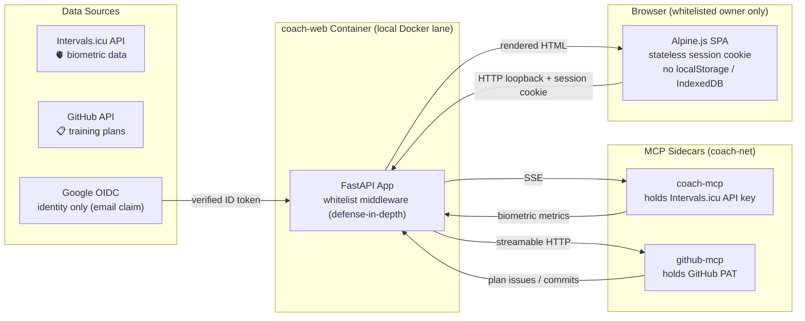
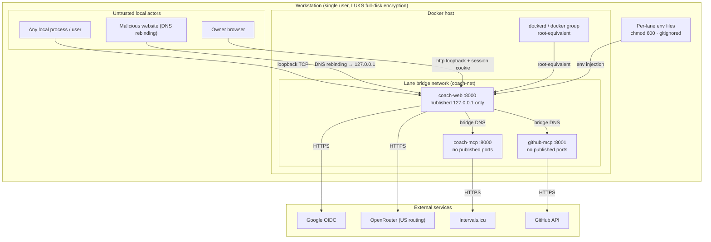
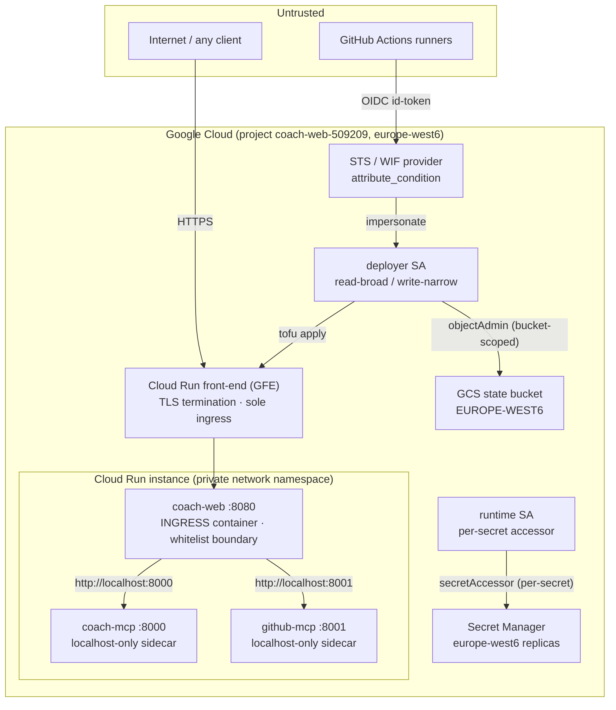

# 🔒 Security & Privacy Policy

## Swiss nLPD (FADP) Compliance

Coach Web processes **biometric and health-related personal data** (resting heart rate, HRV, sleep duration, training load metrics) originating from the Intervals.icu API.

This data is subject to the **Swiss Federal Act on Data Protection (nLPD / FADP)** and the **Cantonal (CH-VD)** data protection regulations.

**Local-first posture (ADR-007, 2026-10-03):** dev, qa, and prod run on the local workstation in loopback-only Docker lanes — biometric data storage and processing never leave the host. The former `europe-west6` cloud residency argument is retired with the GCP topology; the residual cross-border consideration is the OpenRouter LLM call (assessed in #112). The authoritative threat model for this topology is the **Local STRIDE model** below; the retired v0.6.0 cloud model is retained as a clearly-delimited historical appendix.

---

## Access-Control Boundary (ADR-007; OIDC implementation from #65)

**Loopback binding is the primary access control; the Google OIDC email whitelist is defense-in-depth.** All lanes bind `127.0.0.1` only — the application is unreachable from the network by construction. On the prod lane, OIDC adds an authentication layer on top (the lane that can mutate real data via `POST /api/plan/approve`); dev/qa run `AUTH_ENABLED=false`:

- **Google OIDC authorization-code flow** (`/auth/login` → `/auth/callback`): ID tokens are verified as RS256 against the Google JWKS with pinned issuer (both documented Google `iss` forms accepted), pinned audience, single-use nonce binding and a mandatory `email_verified` claim.
- **Whitelist enforcement**: only emails in `AUTH_WHITELIST_EMAILS` (default: `frederic.pitteloud@gmail.com`) may obtain a session — checked at login **and** re-checked on every authenticated request (403 otherwise). An empty whitelist rejects everyone (fail closed).
- **Stateless sessions**: short-lived HS256 JWTs (`iss=coach-web`, `aud=coach-web`, ≥32-byte key) carried in an `HttpOnly; Secure; SameSite=Lax` cookie. No server-side session store — nLPD ephemeral posture.
- **Fail-closed configuration**: `AUTH_ENABLED=true` without client credentials or with a short session secret refuses to boot. Auth is opt-in (`AUTH_ENABLED=false` locally, default).
- **Logout CSRF safety**: `/auth/logout` is POST-only (GET returns 405).
- **Host allowlist (DNS rebinding, #112)**: `TrustedHostMiddleware` rejects any request whose `Host` header is not in `TRUSTED_HOSTS` (default `localhost`, `127.0.0.1`) with **400**. This is critical while dev/qa run `AUTH_ENABLED=false`: without it, a malicious website could resolve a hostname to `127.0.0.1` and reach the loopback service same-origin.

### Cookie `Secure` flag over loopback

Session (`cw_session`) and OIDC-state (`cw_oidc_state`) cookies are set with
`HttpOnly; Secure; SameSite=Lax`. Over the local plain-HTTP topology this is
safe because modern browsers treat loopback as a **trustworthy origin**:

| Browser | Loopback `Secure` cookie over `http://localhost` | Notes |
|:---|:---|:---|
| Chromium ≥ 89 | ✅ sent | `http://localhost` / `http://127.0.0.1` are potentially-trustworthy origins |
| Firefox ≥ 75 | ✅ sent | same loopback exception |
| Safari | ❌ dropped | no localhost exception — session/OIDC-state cookies are not stored over plain HTTP |

`AUTH_COOKIE_SECURE` (default `true`) controls the flag. It exists so a future
plain-HTTP **non-loopback** deployment can be configured; it must never be set
`false` in the loopback topology. Safari users must use a TLS-terminating
front-end (or a browser with the loopback exception) for OIDC login.

### Data Flow & Minimization


```mermaid
graph LR
    subgraph "Data Sources"
        INTERVALS["Intervals.icu API<br/>🫀 biometric data"]
        GITHUB["GitHub API<br/>📋 training plans"]
        GOOGLE["Google OIDC<br/>identity only (email claim)"]
    end

    subgraph "coach-web Container (local Docker lane)"
        APP["FastAPI App<br/>whitelist middleware (defense-in-depth)"]
    end

    subgraph "MCP Sidecars (coach-net)"
        MCP["coach-mcp<br/>holds Intervals.icu API key"]
        GHMCP["github-mcp<br/>holds GitHub PAT"]
    end

    subgraph "Browser (whitelisted owner only)"
        BROWSER["Alpine.js SPA<br/>stateless session cookie<br/>no localStorage / IndexedDB"]
    end

    GOOGLE -->|"verified ID token"| APP
    BROWSER -->|"HTTP loopback + session cookie"| APP
    APP -->|"SSE"| MCP
    APP -->|"streamable HTTP"| GHMCP
    MCP -->|"biometric metrics"| APP
    GHMCP -->|"plan issues / commits"| APP
    APP -->|"rendered HTML"| BROWSER
```

### Key Principles

| Principle | Implementation |
|:---|:---|
| **Data minimization** | Only pertinent metrics are fetched (FTP, HR, HRV, CTL/ATL/TSB, sleep) |
| **Purpose limitation** | Data is used solely for athletic coaching and training visualization |
| **Ephemeral storage** | No persistent client-side storage. No `localStorage`, no `IndexedDB`; the only cookies are the short-lived session and OIDC-state cookies (identity binding, never biometric data) |
| **Single-tenant** | The whitelist admits exactly one Google account; no roles, no multi-user model |

---

## Secret Boundaries

| Secret | Location (ADR-007 local-first) | Never in |
|:---|:---|:---|
| `INTERVALS_API_KEY` | coach-mcp sidecar env only (per-lane env file, #112) | coach-web app, browser, logs |
| `GITHUB_TOKEN` | coach-web env → github-mcp sidecar (per-lane env file; read-only scope dev/qa, read+write prod) | browser, logs |
| `OPENROUTER_API_KEY` | coach-web env only (per-lane env file, #112) | browser, logs |
| `GOOGLE_OIDC_CLIENT_SECRET` | coach-web env only (per-lane env file, #112) | browser, logs, repository |
| `AUTH_SESSION_SECRET` | coach-web env only (≥32 bytes, **distinct per lane**, #112) | browser, logs, repository |

Secrets are injected via per-lane, per-service environment files (`chmod 600`, gitignored) and are never logged or persisted by the application. Each container receives only the secrets it needs — no shared `.env` injecting all secrets into all containers (#112). The former Secret Manager / IaC-managed secret metadata retired with the cloud topology (#111); no secret material ever reached OpenTofu state.

---

## GitHub Token Scope

The web app uses a GitHub Personal Access Token (`GITHUB_TOKEN`) to fetch training plan issues from, and commit approved plan Markdown to, the `fpittelo/coach` repository (via the github-mcp sidecar).

**Required scope:** `repo:read` (or `public_repo` if the repo is public); plan approval additionally writes to the configured plan branch.

The token is passed via environment variable and **never** exposed to the browser client.

---

## OpenRouter Cross-Border Assessment (nLPD, issue #112)

> **Status: assessment with recommended actions — not implemented controls.**
> Local-first (ADR-007) fixes **storage** residency; it does **not** change
> **processing** residency. The coach agent sends biometric context to
> OpenRouter (US-based routing to upstream LLM providers), which is the
> dominant residual nLPD risk.

### (a) Transfer inventory — what reaches OpenRouter

| Field | Source | Sensitivity |
|:---|:---|:---|
| Athlete identity (name / Intervals.icu athlete id) | Intervals.icu via coach-mcp | Personal data |
| Training metrics (FTP, HR, HRV, CTL/ATL/TSB, sleep) | Intervals.icu via coach-mcp | **Health/biometric data (nLPD Art. 5(c))** |
| Plan text / prompts (may embed the above) | coach-web agent | Derived personal data |
| Model + attribution headers (`X-Title`, `HTTP-Referer`) | coach-web | Non-personal |

The API key and session material are **never** sent to OpenRouter.

### (b) Legal basis approach

- Single data subject who is also the controller (self-coaching): the
  processing is within the owner's own sphere. Document a **DPIA-lite** note
  recording purpose (athletic coaching), categories (health metrics), recipients
  (OpenRouter + routed LLM provider), and retention (none server-side by the
  app; provider retention governed by its policy).
- Swiss nLPD Art. 6 (lawfulness / good faith) and Art. 31 (data security)
  principles: purpose limitation, proportionality, and appropriate safeguards.
- Cross-border disclosure to a US recipient requires either an adequacy
  decision, standard data-protection clauses, or **explicit consent**; for a
  single self-controller the pragmatic basis is documented legitimate interest
  plus minimization (below).

### (c) Minimization options (candidate follow-up)

1. **Pseudonymize athlete identity** before the LLM call (replace name/athlete
   id with a stable opaque token).
2. **Strip non-essential metrics** — send only the fields the current coaching
   question needs (e.g. omit sleep/HRV when planning intervals).
3. **Local model fallback** for sensitive turns (out of scope now; note as a
   future option).

These are **recommended actions**, tracked as a follow-up; no minimization is
implemented in this change.

### (d) Provider DPA reference requirement

Before relying on OpenRouter for health data, record a reference to the
provider's Data Processing Agreement / sub-processor list and its retention
terms in the project's compliance notes. Until then, treat the transfer as an
**accepted residual risk** for a single-tenant personal application.

---

## Container Hardening

- **Non-root execution**: Runs as unprivileged user `coach-web` (`UID:GID 10001:10001`)
- **Multi-stage build**: Final image contains only runtime dependencies, no build tools
- **Minimal base image**: `python:3.12-slim` (Debian slim, not full)
- **No shell access**: `ENTRYPOINT` runs `uvicorn coach_web.app:create_app --factory`, not `/bin/bash`
- **Read-only filesystem**: Container filesystem mounted read-only where possible

---

## STRIDE Threat Model — Local Topology (ADR-007, v0.8.0)

> **Authoritative model.** This replaces the v0.6.0 Cloud Run STRIDE analysis as the current threat model. The cloud model is retained as a clearly-delimited historical appendix at the end of this document (it records the retired release's analysis and must not be silently deleted).

### Trust Boundaries


```mermaid
graph TD
    subgraph "Workstation (single user, LUKS full-disk encryption)"
        subgraph "Untrusted local actors"
            LOCAL["Any local process / user"]
            SITE["Malicious website (DNS rebinding)"]
            BROWSER["Owner browser"]
        end
        subgraph "Docker host"
            DOCKERD["dockerd / docker group<br/>root-equivalent"]
            subgraph "Lane bridge network (coach-net)"
                WEB["coach-web :8000<br/>published 127.0.0.1 only"]
                MCP["coach-mcp :8000<br/>no published ports"]
                GHMCP["github-mcp :8001<br/>no published ports"]
            end
        end
        ENVFILES["Per-lane env files<br/>chmod 600 · gitignored"]
    end
    subgraph "External services"
        GOOGLE["Google OIDC"]
        OPENROUTER["OpenRouter (US routing)"]
        INTERVALS["Intervals.icu"]
        GITHUB["GitHub API"]
    end
    LOCAL -->|"loopback TCP"| WEB
    SITE -->|"DNS rebinding → 127.0.0.1"| WEB
    BROWSER -->|"http loopback + session cookie"| WEB
    DOCKERD -->|"root-equivalent"| WEB
    WEB -->|"bridge DNS"| MCP
    WEB -->|"bridge DNS"| GHMCP
    WEB -->|"HTTPS"| GOOGLE
    WEB -->|"HTTPS"| OPENROUTER
    MCP -->|"HTTPS"| INTERVALS
    GHMCP -->|"HTTPS"| GITHUB
    ENVFILES -->|"env injection"| WEB
```

### Boundary B1 — Local processes/users → loopback service

| STRIDE | Threat | Mitigation |
|:---|:---|:---|
| **Spoofing** | Any local process or user reaches `127.0.0.1:<port>` and impersonates the owner | Loopback binding is the primary control; on prod, Google OIDC + `AUTH_WHITELIST_EMAILS` re-checked on every request (403). Single-user workstation is the trust assumption. |
| **Elevation of Privilege** | A local unprivileged process uses the app as a confused deputy to reach sidecars/secrets | Sidecars publish no host ports; secrets are scoped per service; the app never exposes secret material. |
| **Information Disclosure** | A local process reads biometric data from the API | Accepted local trust assumption (single user); OIDC on prod; no multi-user model. |

### Boundary B2 — DNS rebinding → loopback

| STRIDE | Threat | Mitigation |
|:---|:---|:---|
| **Spoofing** | A malicious website resolves a hostname to `127.0.0.1` and reaches the service same-origin (critical while dev/qa run `AUTH_ENABLED=false`) | `TrustedHostMiddleware` rejects any `Host` not in `TRUSTED_HOSTS` (default `localhost`, `127.0.0.1`) with **400** (implemented #118). |
| **Tampering** | Cross-origin request mutates state | `SameSite=Lax` session cookie; CORS restricted to the lane's loopback origin. |

### Boundary B3 — Docker socket / `docker` group = root-equivalent

| STRIDE | Threat | Mitigation |
|:---|:---|:---|
| **Elevation of Privilege** | Membership in the `docker` group (or access to `/var/run/docker.sock`) is root-equivalent: a member can mount the host filesystem into a container | **Accepted local trust assumption**, documented. The workstation is single-user; the owner is the only `docker` group member. Containers run non-root, read-only rootfs, `cap_drop: ALL`, `no-new-privileges`. |
| **Tampering** | A compromised container escapes to the host | Hardened runtime (non-root, read-only, dropped caps); no privileged containers; no host mounts. |

### Boundary B4 — coach-web → sidecars on the lane bridge network

| STRIDE | Threat | Mitigation |
|:---|:---|:---|
| **Spoofing** | Any container on the lane bridge can reach `github-mcp`/`coach-mcp` by DNS name | Sidecars publish nothing to the host; the lane network is per-project (`<project>_coach-net`), so only containers of the same lane share it. Accepted: any container on the lane net can reach the sidecars. |
| **Information Disclosure** | A sidecar leaks its secret to another container | Per-service secret scoping: `coach-mcp` holds only `INTERVALS_API_KEY`; `github-mcp` only the GitHub PAT; `coach-web` never receives the Intervals key. |
| **Denial of Service** | A sidecar crash silently passes the gate | Pre-flight asserts the exact service set via `docker compose ps -a` (exited containers included) and all healthchecks healthy (#113). |

### Boundary B5 — Browser → app session

| STRIDE | Threat | Mitigation |
|:---|:---|:---|
| **Tampering** | Forged/edited session cookie | HS256 JWT, ≥32-byte secret, pinned `algorithms=["HS256"]`, `iss`/`aud`/`exp`/`iat`/`sub`/`email` required, per-token `jti`. `HttpOnly; Secure; SameSite=Lax`. |
| **Spoofing (CSRF/state)** | Login-CSRF / replayed OIDC state | `state` doubles as nonce, bound to a single-use `cw_oidc_state` cookie, `compare_digest`, deleted on every callback exit. |
| **Information Disclosure** | Session/biometric data leaking to the client | No `localStorage`/`IndexedDB`; cookies carry identity only; sanitized JSON errors. |
| **Spoofing (cookie over loopback)** | `Secure` cookie dropped over plain HTTP | Chromium/Firefox treat loopback as trustworthy and send it; **Safari does not** — Safari users need a TLS front-end. `AUTH_COOKIE_SECURE` must stay `true`. |

### Boundary B6 — Plan approval: repudiation

`POST /api/plan/approve` is state-changing (schedules workouts on Intervals.icu, commits plan Markdown to GitHub). Repudiation is mitigated by a three-way external audit trail:

1. **GitHub commit history** — every approved plan is an attributed commit in `fpittelo/coach`.
2. **Intervals.icu workout records** — scheduled workouts are queryable in the athlete's calendar.
3. **Local structured application logs** — container stdout captured by the Docker host; secrets never logged. **Cloud Logging is gone** (retired with the GCP topology, #111); the local log retention policy is documented in the admin guide (bounded Docker log rotation, secret redaction).

Because a single whitelisted identity is admitted, any approval is attributable to the owner by construction. **Residual:** an unattended unlocked browser could approve on the owner's behalf — accepted for a single-tenant personal app; session TTL bounded (`AUTH_SESSION_TTL_SECONDS=3600`).

### Boundary B7 — Plaintext env secrets on disk

| STRIDE | Threat | Mitigation |
|:---|:---|:---|
| **Information Disclosure** | A local process/user reads `.env.<lane>` and exfiltrates API keys | Per-lane env files are `chmod 600` and gitignored; **LUKS full-disk encryption** is the at-rest expectation; secrets are never committed (gitleaks full-history scan). |
| **Elevation of Privilege** | A leaked lane file grants more than its scope | Per-service secret scoping: a leaked lane file can do no more than the declared `${...}` scope allows. |

### Boundary B8 — OpenRouter cross-border processing

| STRIDE | Threat | Mitigation |
|:---|:---|:---|
| **Information Disclosure** | Biometric context is sent to a US-routed LLM provider | Local-first fixes **storage** residency, not **processing** residency. The transfer inventory, legal-basis approach, minimization options and DPA requirement are assessed in the **OpenRouter Cross-Border Assessment (#112)** section above. Accepted residual risk for a single self-controller; minimization tracked as follow-up. |

### Boundary B9 — Untrusted content → DOM (v0.7 markdown rendering, #81)

Assistant messages render `DOMPurify.sanitize(marked.parse(text))` via `x-html` (assistant-only; user messages stay `x-text`; the plan card stays structured Pydantic→HTML). The threat sources are **LLM output** and **MCP tool payloads** (e.g. GitHub issue bodies) that flow through the agent into assistant tokens.

| STRIDE | Threat | Mitigation |
|:---|:---|:---|
| **Tampering** | LLM/MCP content carries `<script>`, ``, a `javascript:` URI, or an Alpine `x-` directive into the assistant bubble | Assistant-only `x-html` bound to `DOMPurify.sanitize(marked.parse(text))`; DOMPurify's default allowlist strips `script`/`style`/`iframe`/`object`/`embed`/`form`, event-handler attributes, `javascript:` URIs and every `x-*`/`@*`/`:*` directive; user messages never render as HTML. Contract test asserts the sanitizer helper and assistant-only `x-html`. |
| **Elevation of Privilege** | An injected `x-init`/`@click`/`x-html` directive is evaluated by Alpine's MutationObserver when the sanitized node is inserted | DOMPurify strips non-allowlisted attributes (Alpine directives are not in the default allowlist); CSP `script-src 'self'` blocks inline script; the sanitizer config must **not** add `ALLOWED_ATTR` entries for `x-*`/`@*`/`:*`. |
| **Information Disclosure** | A remote `` in LLM markdown leaks the viewer IP or acts as a tracking pixel | CSP `img-src 'self' data:` blocks remote image loads. |
| **Denial of Service** | Pathological markdown (deep nesting, huge token stream) | Message/history caps (8,000 chars × 10 entries) bound the input; marked/DOMPurify are synchronous and bounded; no server-side render. |

**Mid-stream partial-render safety:** every token render re-sanitizes the **full accumulated raw text** (never appends per-token sanitized fragments), so a construct split across tokens (`<scr` + `ipt>`) is only ever sanitized as a whole at the final render; DOMPurify repairs unclosed tags. **Condition:** the implementation must sanitize the accumulated raw string, not concatenate per-token sanitized HTML.

### Boundary B10 — Client-owned replayed history (prompt injection, #79)

The conversation is client-owned: the browser replays the last ≤ 10 turns in the POST body and nothing is persisted server-side (nLPD ephemeral posture). The history is therefore fully forgeable.

| STRIDE | Threat | Mitigation |
|:---|:---|:---|
| **Spoofing** | Client forges assistant turns to impersonate the coach | Inherent to client-owned history; no server session store (nLPD ephemeral). **Accepted residual.** |
| **Tampering** | Forged history injects instructions (jailbreak / system-prompt override) | `ChatMessage.role` is `Literal["user", "assistant"]` — a forged `system`/`tool` role is rejected at the Pydantic boundary; the system prompt is always first in `_build_messages`; entry/length caps bound the payload. |
| **Elevation of Privilege** | Forged history induces tool invocation with attacker-chosen arguments | Tools are read-only (Intervals.icu, GitHub issues) except the synthetic `propose_plan`, which only emits a validated `PlanProposal`; the sole state-changing path `POST /api/plan/approve` requires an explicit human click and re-validates the exact `PlanProposal` JSON. **Human approval is the security boundary.** |
| **Repudiation** | Forged transcript misrepresents what the coach said | The transcript is client-owned and ephemeral; there is no server-side conversation audit. The approval audit trail (GitHub commits + Intervals.icu records) is independent of the transcript. |
| **Denial of Service** | Oversized or looping history | `max_length=10` entries × 8,000 chars; agent tool-iteration cap (`AGENT_MAX_TOOL_ITERATIONS`). |
| **Information Disclosure** | Forged history exfiltrates biometric data to a third party | Single-tenant; the only recipient is the owner's own browser; no attacker-controlled outbound channel. OpenRouter processing is already assessed (B8). |

**Residual-risk acceptance:** prompt injection via forged assistant turns cannot be eliminated without server-side session state, which contradicts the nLPD ephemeral posture. Accepted for a single-tenant personal app where the only user is the owner and every state-changing action is gated by explicit human approval.

### CSP Posture (v0.7)

The repo ships **no CSP header** today. The vendored Alpine 3.14.9 is the **standard build**: it compiles `x-` expressions at runtime via `Object.getPrototypeOf(async function(){}).constructor` (`AsyncFunction`), so `script-src` must include `'unsafe-eval'`. **Decision (KIS): ship the minimal defensible CSP now**, not the Alpine CSP build — the latter would require rewriting every inline `x-` expression to `Alpine.bind`/`x-data` methods, disproportionate churn for v0.7.

Recommended header (implemented in #81 or a dedicated follow-up):

```
Content-Security-Policy:
  default-src 'self';
  script-src 'self' 'unsafe-eval';
  style-src 'self';
  img-src 'self' data:;
  font-src 'self';
  connect-src 'self';
  object-src 'none';
  base-uri 'self';
  frame-ancestors 'none';
  form-action 'self'
```

**Rationale:** `'unsafe-eval'` is required by Alpine and is **contained** — `script-src` has no `'unsafe-inline'`, so an injected inline `<script>` is blocked, and DOMPurify strips `x-` directives, so the eval primitive has no injection vector to reach it. The remaining directives are free defense-in-depth: `object-src 'none'` (plugins), `base-uri 'self'` (base-tag injection), `frame-ancestors 'none'` (clickjacking), `form-action 'self'` (form exfiltration), `img-src 'self' data:` (tracking pixels). The Alpine CSP build is tracked as a **future hardening item**, not a v0.7 requirement.

### Local STRIDE Summary Table

| STRIDE | Primary vector (local topology) | Mitigation (anchor) |
|:---|:---|:---|
| **Spoofing** | Any local process reaches loopback; DNS rebinding; forged session; replayed OIDC state; forged replayed history (B10) | Loopback binding primary + OIDC whitelist (prod); `TrustedHostMiddleware` Host allowlist (#118); HS256 session with pinned iss/aud; single-use OIDC state/nonce; history role `Literal` + human approval gate (B10) |
| **Tampering** | Cookie/API tampering; container escape; cross-origin mutation; untrusted LLM/MCP content → DOM (B9) | HS256 signature + algorithm pinning; non-root/read-only/`cap_drop: ALL` containers; `SameSite=Lax` + lane-scoped CORS; DOMPurify sanitization of assistant-only `x-html` (B9) |
| **Repudiation** | Owner denies an approval | GitHub commits + Intervals.icu records + local structured logs (secret-redacted); single whitelisted identity |
| **Information Disclosure** | Plaintext env secrets; sidecar secret leakage; biometric data to OpenRouter | `chmod 600` gitignored env files + LUKS; per-service secret scoping; OpenRouter assessment (#112) |
| **Denial of Service** | Sidecar crash silently passing the gate; upstream stalls | Pre-flight exact service-set assertion via `ps -a` (#113); upstream timeouts; agent tool-iteration cap |
| **Elevation of Privilege** | `docker` group = root-equivalent; leaked lane file; path traversal; Alpine directive injection (B9) | Documented accepted local trust assumption; per-service secret scoping; default-deny path normalization; non-root containers; DOMPurify strips `x-` directives + CSP `script-src 'self'` (B9) |

---

## Historical Appendix — v0.6.0 Cloud Run STRIDE Model (retired)

> **⚠️ Historical record only.** The model below is the authoritative STRIDE analysis of the **retired v0.6.0 Cloud Run topology**. The GCP platform is decommissioned (#111); it is retained here so the release's analysis is not lost. Do not use it as the current threat model — see the Local Topology model above.

<details>
<summary>Click to expand the retired v0.6.0 Cloud Run STRIDE analysis (issue #68)</summary>

The v0.6.0 release moved the application from a single-container local compose topology to a **serverless multi-container Cloud Run service in `europe-west6`** fronted by an unauthenticated edge, with keyless CI federation and Secret Manager. This section is the authoritative STRIDE analysis of that cloud topology; the table below is the per-boundary summary.

### Trust Boundaries


```mermaid
graph TD
    subgraph "Untrusted"
        INTERNET["Internet / any client"]
        GHACTIONS["GitHub Actions runners"]
    end

    subgraph "Google Cloud (project coach-web-509209, europe-west6)"
        GFE["Cloud Run front-end (GFE)<br/>TLS termination · sole ingress"]
        subgraph "Cloud Run instance (private network namespace)"
            WEB["coach-web :8080<br/>INGRESS container · whitelist boundary"]
            MCP["coach-mcp :8000<br/>localhost-only sidecar"]
            GHMCP["github-mcp :8001<br/>localhost-only sidecar"]
        end
        STS["STS / WIF provider<br/>attribute_condition"]
        DEPLOYER["deployer SA<br/>read-broad / write-narrow"]
        RUNTIME["runtime SA<br/>per-secret accessor"]
        SM["Secret Manager<br/>europe-west6 replicas"]
        STATE["GCS state bucket<br/>EUROPE-WEST6"]
    end

    INTERNET -->|"HTTPS"| GFE --> WEB
    WEB -->|"http://localhost:8000"| MCP
    WEB -->|"http://localhost:8001"| GHMCP
    GHACTIONS -->|"OIDC id-token"| STS -->|"impersonate"| DEPLOYER
    DEPLOYER -->|"tofu apply"| GFE
    RUNTIME -->|"secretAccessor (per-secret)"| SM
    DEPLOYER -->|"objectAdmin (bucket-scoped)"| STATE
```

### Boundary 1 — CI → GCP: Workload Identity Federation (keyless)

| STRIDE | Threat | Mitigation |
|:---|:---|:---|
| **Spoofing** | A foreign GitHub repository or a PR from a fork impersonates the CI deployer | `attribute_condition` pins **both** repository and ref before any IAM evaluation: `assertion.repository == "fpittelo/coach-web"` AND (`refs/heads/dev` ∥ `refs/heads/qa` ∥ `refs/heads/main` ∥ `refs/tags/v*`). `refs/pull/*`, feature branches and non-`v` tags are rejected at the **STS token exchange**. `allowed_audiences` is pinned to `https://github.com/fpittelo`; the deployer SA binding uses a repo-scoped `principalSet` (`attribute.repository/fpittelo/coach-web`), not a wildcard. |
| **Elevation of Privilege** | CI mints long-lived credentials | **No service-account keys exist anywhere** — federation only (ADR-06). The deployer is **read-broad / write-narrow**: project READ via `roles/viewer` + `roles/iam.securityReviewer` (both zero-write, needed by `tofu apply`'s refresh phase), while writes stay narrow (`roles/run.admin`, SA-scoped `serviceAccountUser`, bucket-scoped `storage.objectAdmin`). The deployer deliberately holds **no** `secretmanager.secretAccessor` — it never reads secret values. |
| **Tampering** | A compromised workflow deploys an arbitrary image | Deploys are digest-pinned (`ghcr.io/...@sha256:...`) and the production deploy environment is gated on explicit PO approval. |

### Boundary 2 — Internet → Cloud Run: unauthenticated edge

| STRIDE | Threat | Mitigation |
|:---|:---|:---|
| **Spoofing** | Anonymous access to dashboard/API | `INGRESS_TRAFFIC_ALL` + `allUsers` invoker is **only** acceptable because ADR-04 makes the **application-level Google OIDC email whitelist the access-control boundary** (ADR-04, superseded by ADR-007 — loopback binding is primary in the local topology) (`infra/modules/cloud-run/main.tf`, carried review item #2 from #64). The edge is a transport door, not an authorization decision. Default-deny middleware protects every path except `PUBLIC_PATHS = {/ , /health, /healthz}` and `PUBLIC_PREFIXES = (/static/, /auth/)`; `/api/*` returns **401** without a valid session, and a non-whitelisted identity gets **403** on every request. |
| **Elevation of Privilege** | Path traversal to reach a public path | `is_public_path()` normalizes the raw ASGI path with `posixpath.normpath` and fails closed on any residual `..` segment, so `/static/../api/...` cannot be classified public. |

### Boundary 3 — uvicorn proxy-header trust (local posture, #112)

`uvicorn` runs with `--proxy-headers --forwarded-allow-ips='127.0.0.1,::1'`
(Dockerfile). The local topology has **no trusted reverse proxy**: compose
publishes coach-web on `127.0.0.1` only, so only loopback peers may set
`X-Forwarded-*`. A remote client cannot spoof the scheme/host used to derive
the OIDC `redirect_uri` (`_resolve_redirect_uri()` reads `request.base_url`).

- Direct `http://localhost:8000` access derives correct `http://` URLs; no
  `X-Forwarded-Proto` is needed locally.
- **Topology-dependent (review 5260511893, PR #100):** the flag was `'*'` for
  the retired Cloud Run topology, where the GFE was the sole ingress and always
  set `X-Forwarded-Proto` (live incident: redirect_uri mismatch, PR #100).
  **Any future ingress change (proxy, non-loopback publish) must re-validate
  this flag in the same change.**
- `--forwarded-allow-ips` also broadens trust of `X-Forwarded-For` →
  `scope["client"]`; the app makes **no security decision on client IP** (no
  `request.client` / `scope["client"]` usage in `src/`), so there is no impact.

### Boundary 4 — Runtime SA → Secret Manager

Per-secret IAM (`roles/secretmanager.secretAccessor` bound to each secret individually) replaces the former project-level grant (carried review item #1 from #64): the runtime SA can read **exactly the five secrets this stack defines and nothing else**. Replication is **user-managed, pinned to `europe-west6`** — automatic replication would spread health-data access tokens across Google-managed regions (nLPD). No secret version is ever managed by or stored in IaC/state.

### Boundary 5 — coach-web → sidecars: localhost-only

Cloud Run sidecars share the instance's network namespace; `coach-mcp :8000` and `github-mcp :8001` are reachable **only over `http://localhost`**. Sidecars must **not** declare a `ports` block (Cloud Run v2 permits exactly one exposed port — the main ingress container; declaring one is an API-level validation failure, live incidents #66/#96). Sidecar startup probes use **TCP socket probes**, never HTTP:

- `coach-mcp` serves **SSE (`/sse`)**; an HTTP probe would never complete (the stream stays open) and each aborted probe tears the instance down (live incident #66). A TCP probe proves the listener is up without touching the stream.
- `github-mcp` exposes no plain HTTP health endpoint; TCP is the closest safe equivalent.

**Consequence:** the SSE endpoint is **not exposed at the edge** — only the ingress container's port 8080 is routable from outside; `/api/agent/stream` on 8080 is session-gated and re-checked by the whitelist middleware.

### Boundary 6 — Browser → app: session & OIDC state

| STRIDE | Threat | Mitigation |
|:---|:---|:---|
| **Tampering** | Forged/edited session cookie | HS256 JWT with a **≥32-byte** secret (RFC 7518, enforced at boot: `validate_auth_config` raises `AuthConfigError` otherwise); decode pins `algorithms=["HS256"]`, `issuer=coach-web`, `audience=coach-web`, and **requires** `exp`, `iat`, `sub`, `aud`, `email`. A per-token **`jti`** is minted for traceability. `HttpOnly; Secure; SameSite=Lax`. |
| **Spoofing (CSRF/state)** | Login-CSRF / replayed OIDC state | `state = secrets.token_urlsafe(32)` doubles as the ID-token **nonce**; it is bound to a `cw_oidc_state` cookie (`HttpOnly; Secure; SameSite=Lax`, TTL 600 s) and compared with `secrets.compare_digest`. The cookie is **deleted on every callback exit — success and failure** (`_state_cleared`), preserving the single-use guarantee. ID tokens are verified RS256 against the Google JWKS with `kid` lookup, pinned `aud`/`iss`, `email_verified is True`, and nonce match. |
| **Spoofing (logout CSRF)** | Third-party page force-logs-out the owner | `/auth/logout` is **POST-only** (GET → 405). |
| **Information Disclosure** | Session/biometric data leaking to the client | No `localStorage`/`IndexedDB`; cookies carry identity only, never biometric data; error responses are sanitized JSON (`{"detail": ...}`) with no secrets or stack traces. |

### Boundary 7 — Plan approval: repudiation

`POST /api/plan/approve` **is state-changing**: it schedules workouts on Intervals.icu and commits plan Markdown to GitHub. Repudiation is mitigated by a **three-way external audit trail**:

1. **GitHub commit history** — every approved plan is a signed-by-attribution commit in `fpittelo/coach`.
2. **Intervals.icu workout records** — scheduled workouts are queryable in the athlete's calendar.
3. **Structured application logs** — Cloud Logging entries (the runtime SA has `roles/logging.logWriter`), with secrets never logged.

Because a single whitelisted identity is admitted, any approval is attributable to the owner by construction. **Residual:** the boundary is enforced by the session cookie; an unattended unlocked browser could approve on the owner's behalf. This is accepted for a single-tenant personal app and is a PO-checklist item (session TTL is bounded — app default `AUTH_SESSION_TTL_SECONDS=3600`).

### Boundary 8 — Denial of Service & cost

| STRIDE | Threat | Mitigation |
|:---|:---|:---|
| **Denial of Service** | Request floods / upstream stalls / instance teardown | `minScale=0`, `maxScale=2` bounds blast radius and cost; upstream timeouts (OpenRouter, MCP sidecars, Google endpoints, `HTTP_TIMEOUT_SECONDS=30`); agent tool-iteration cap (`AGENT_MAX_TOOL_ITERATIONS`); graceful exception handling. Scale-to-zero also caps the *cost* of a flood to the request-driven price only. |

### Cloud STRIDE Summary Table

| STRIDE | Primary vector (cloud topology) | Mitigation (anchor) |
|:---|:---|:---|
| **Spoofing** | Foreign repo/ref federating into GCP; anonymous edge access; forged session | WIF `attribute_condition` (repo + ref) + pinned `allowed_audiences`; app-level OIDC whitelist **is** the boundary (ADR-04, superseded by ADR-007); HS256 session with pinned iss/aud and required claims; OIDC state/nonce single-use |
| **Tampering** | Cookie/API tampering; arbitrary CI image; spoofed `X-Forwarded-*` | HS256 signature + `algorithms=[...]` pinning; digest-pinned images + gated prod deploy; GFE sole-ingress proxy-header trust (topology-dependent, caveat recorded) |
| **Repudiation** | Owner denies an approval | GitHub commits + Intervals.icu records + structured logs; single whitelisted identity |
| **Information Disclosure** | Biometric data / credential leakage | Data rendered only inside a whitelisted session; secrets env-only via Secret Manager; sanitized errors; no client persistence; per-secret IAM; europe-west6 replication |
| **Denial of Service** | Floods, upstream stalls, SSE probe teardown | `minScale=0`/`maxScale=2`; timeouts; tool-iteration cap; TCP (not HTTP) sidecar probes |
| **Elevation of Privilege** | Secret extraction; path traversal; over-broad CI identity | Per-secret `secretAccessor` (no project-level grant); default-deny path normalization; read-broad/write-narrow deployer with no secret access; non-root container |

### Historical nLPD Compliance Checklist (v0.6.0 cloud topology)

| # | Requirement | Status | Evidence |
|:---|:---|:---|:---|
| 1 | All data-bearing resources in `europe-west6` | ✅ | Cloud Run `location=europe-west6`; Secret Manager user-managed replicas `europe-west6` (×5); GCS state bucket `EUROPE-WEST6`; VPC subnet `europe-west6` |
| 2 | Health/biometric data processed in-region | ✅ | Intervals.icu metrics flow through `coach-mcp` inside the `europe-west6` Cloud Run instance; no cross-region storage |
| 3 | Access control = loopback binding (primary) + OIDC whitelist (defense-in-depth) | ✅ | All lanes publish on `127.0.0.1` only; Google OIDC (RS256, pinned iss/aud, nonce) + `AUTH_WHITELIST_EMAILS`, re-checked every request (403); fail-closed boot |
| 4 | Audit trail available | ✅ | Cloud Audit Logs + Cloud Logging (`roles/logging.logWriter`); GitHub commit history; Intervals.icu records; GCS state versioning |
| 5 | Data minimization | ✅ | Pertinent metrics only; no client-side persistence; secrets never logged |
| 6 | Encryption in transit | ✅ | HTTPS/TLS terminated at the GFE; Google APIs over HTTPS |
| 7 | Encryption at rest | ✅ | Google-managed encryption for Secret Manager, GCS, Cloud Run |
| 8 | No persistent browser storage of personal data | ✅ | No `localStorage`/`IndexedDB`; identity-only cookies |

### Historical Compliance Checklist (v0.6.0 cloud topology)

- [x] No biometric data stored persistently in the browser
- [x] No API key exposed to the client side
- [x] Non-root container execution
- [x] Minimal data fetching (pertinent metrics only)
- [x] Google OIDC whitelist authentication enforced at application level (ADR-04, #65; superseded by ADR-007 — loopback primary, OIDC defense-in-depth)
- [x] Stateless sessions — no server-side session store (scale-to-zero compatible)
- [x] Fail-closed auth configuration (refuses to boot misconfigured)
- [x] Keyless CI (WIF, no service-account keys) with repo+ref-scoped trust (ADR-06)
- [x] Per-secret Secret Manager IAM (no project-level `secretAccessor`)
- [x] All data-bearing resources pinned to `europe-west6` (nLPD)

</details>

---

## Dependency Vulnerability Scanning

- **Python**: `pip-audit --strict` runs in CI (`ci.yaml`, `dependency-scan` job) — zero known CVEs.
- **Docker**: `trivy` image scan runs in CI (`ci.yaml`, `image-scan` job) — fails on **HIGH/CRITICAL** OS/library CVEs (`--exit-code 1 --severity HIGH,CRITICAL`); LOW/MEDIUM are reported but non-failing.
- **Secrets**: `gitleaks` scans the **full commit history** (`fetch-depth: 0`) in CI (`ci.yaml`, `secret-scan` job) — zero leaked credentials.

### Accepted-Risk Register (`.trivyignore`)

The trivy gate stays strict (`--exit-code 1`, no ignore-unfixed) for everything except the time-boxed entries in `.trivyignore` at the repo root. Each entry carries an `# exp: YYYY-MM-DD` comment and is re-triaged at that date; a test in `tests/integration/test_compose_topology.py` enforces that every CVE entry is time-boxed and that no expiry has passed.

Current acceptances (2026-10-03): 8 unfixed debian 13.7 (trixie) OS packages in the `python:3.12-slim` base image (util-linux, acl, ncurses, systemd, perl — no fixed version available upstream; re-triage 2027-01-03) and 1 pcre2 CVE whose fix (`10.46-1~deb13u3`) is not yet in the base image (re-triage 2026-11-03). Python dependencies are clean via `pip-audit --strict`. The openssl findings were cleared by a fresh base pull; the pcre2 acceptance expires pending a base refresh.

---

## nLPD Compliance Checklist (local-first, v0.8.0)

> **Authoritative checklist for the local-first topology.** The retired v0.6.0 cloud checklist is preserved in the historical appendix above.

| # | Requirement | Status | Evidence |
|:---|:---|:---|:---|
| 1 | Loopback-only binding as the primary access control | ✅ | All lanes publish `127.0.0.1` only; sidecars publish no host ports; pre-flight asserts it (`scripts/e2e-preflight.sh`) |
| 2 | Local encryption at rest | ✅ | LUKS full-disk encryption on the workstation (expectation); per-lane env files `chmod 600` and gitignored |
| 3 | Backup policy for persisted biometric data | ✅ (N/A) | The app persists **no** biometric data server-side (ephemeral posture); no backup of personal data exists. Any future persistence must add an encrypted-backup policy before shipping |
| 4 | Workstation access control | ✅ | Single-user workstation; OS screen lock; `docker` group membership is the documented root-equivalent trust assumption (B3) |
| 5 | Local log retention with secret redaction | ✅ | Container stdout captured by the Docker host with bounded log rotation; secrets never logged; Cloud Logging retired (#111) |
| 6 | OpenRouter cross-border assessment | ✅ | Documented in the OpenRouter Cross-Border Assessment (#112) — accepted residual risk for a single self-controller |
| 7 | Data minimization | ✅ | Pertinent metrics only; no client-side persistence; secrets never logged |
| 8 | No persistent browser storage of personal data | ✅ | No `localStorage`/`IndexedDB`; identity-only cookies |
| 9 | Encryption in transit | ✅ | HTTPS/TLS to Google, OpenRouter, Intervals.icu, GitHub; loopback plain HTTP accepted (local, single-user) |
| 10 | Audit trail | ✅ | GitHub commit history + Intervals.icu records + local structured logs (secret-redacted) |

---

## Compliance Checklist (local-first, v0.8.0)

- [x] No biometric data stored persistently in the browser
- [x] No API key exposed to the client side
- [x] Non-root container execution (UID:GID 10001:10001)
- [x] Minimal data fetching (pertinent metrics only)
- [x] Loopback-only binding as the primary access control (ADR-007)
- [x] Google OIDC whitelist authentication enforced on the prod lane (defense-in-depth)
- [x] `TrustedHostMiddleware` Host allowlist (DNS-rebinding mitigation, #118)
- [x] Stateless sessions — no server-side session store
- [x] Fail-closed auth configuration (refuses to boot misconfigured)
- [x] Per-lane, per-service secret scoping (`chmod 600`, gitignored env files)
- [x] Local encryption at rest (LUKS full-disk; `chmod 600` env files)
- [x] Full-history secret scanning (gitleaks) + dependency scanning (`pip-audit --strict`) + image scanning (trivy HIGH/CRITICAL)
- [x] OpenRouter cross-border transfer assessed and documented (#112)

---

## Related Documents

| Document | Owner | Content |
|:---|:---|:---|
| [Architecture](architecture.md) | @architect | ArchiMate model, C4 diagrams, ADRs |
| [Admin Guide](admin_guide.md) | @fpittelo | Operations, configuration & release gate |
| [E2E Checklist](e2e-checklist.md) | @fpittelo | Manual prod-lane E2E verification (v0.8.0) |

---

_Last updated: 2026-10-03 (issue #87 — v0.7 STRIDE addendum: untrusted-content→DOM sanitization (B9), client-owned replayed history (B10), CSP posture; prior: issue #113 local-topology STRIDE rewrite)_
