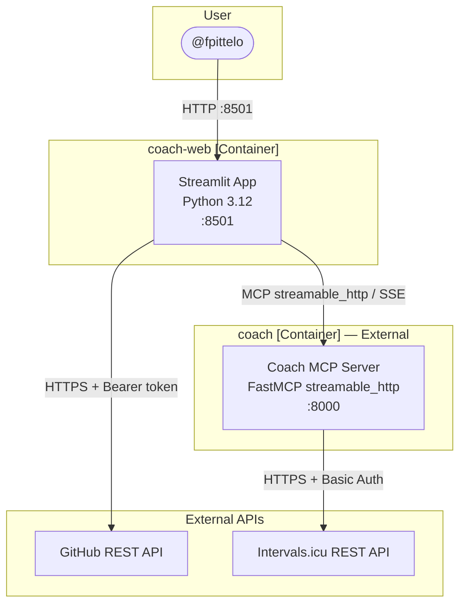
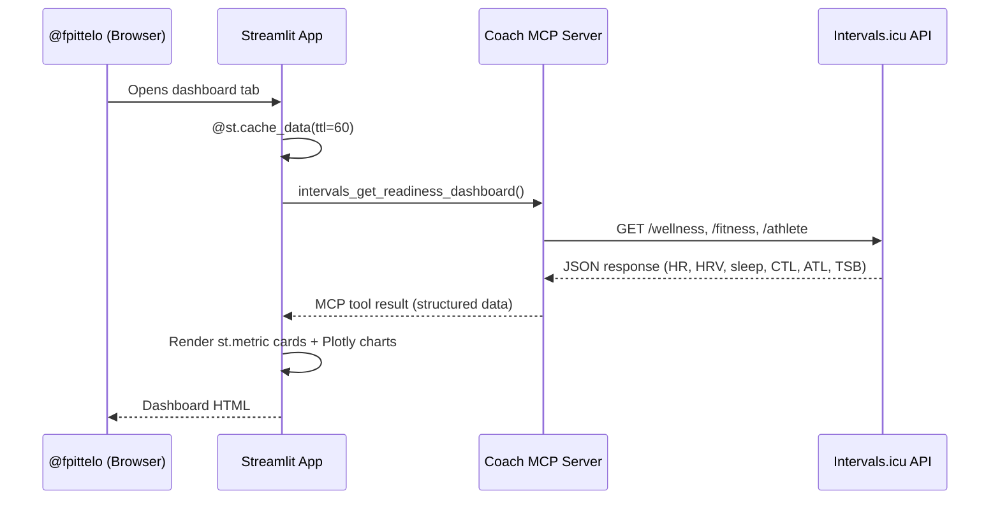
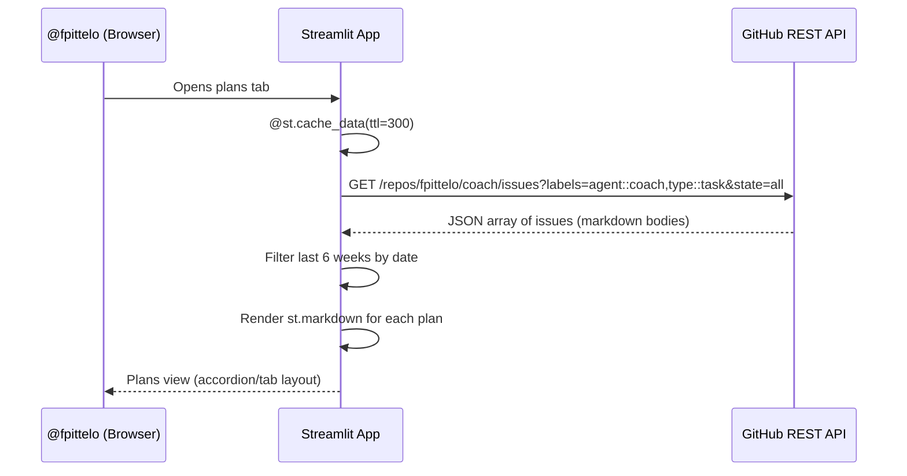
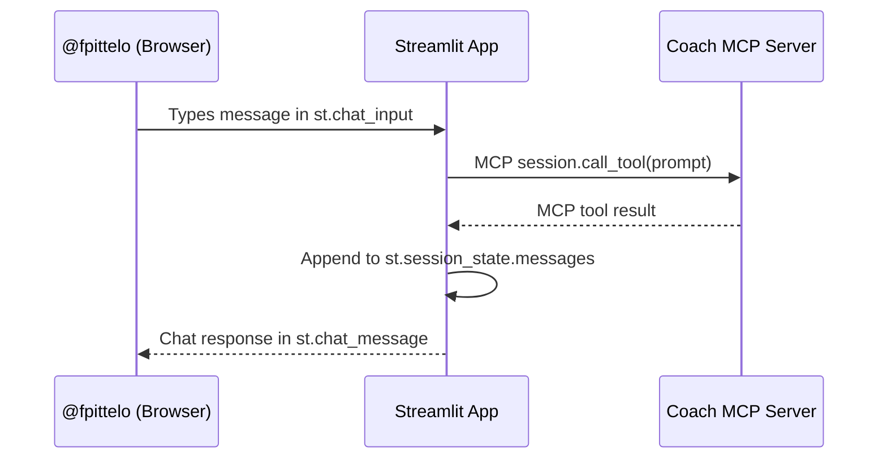

# 📙 Technical Specifications — Coach Web

**Audience:** @architect, @developer  
**Last updated:** 2026-09-05

---

## 1. Overview

Coach Web is a Python-native Streamlit web application that serves as the interactive frontend for the Coach MCP server. It provides:

1. **Readiness Dashboard** — biometric metrics from Intervals.icu via MCP
2. **Weekly Training Plans** — past 5 weeks + current week from GitHub issues
3. **Coach Chat** — conversational interface to the Coach MCP server

---

## 2. Technology Stack

| Layer | Technology | Version |
|:---|:---|:---|
| **Language** | Python | 3.12 |
| **Web framework** | Streamlit | >= 1.39 |
| **Charting** | Plotly (built into Streamlit) | >= 5.0 |
| **MCP Client** | `mcp[cli]` Python SDK | >= 2.0 |
| **HTTP client** | `httpx` | >= 0.27 |
| **Validation** | Pydantic v2 | >= 2.7 |
| **Settings** | `pydantic-settings` | >= 2.2 |
| **Env loading** | `python-dotenv` | >= 1.0 |
| **Container** | `python:3.12-slim` | — |

---

## 3. Architecture — C4 Container View



---

## 4. Module Structure

```
coach-web/
├── src/
│   └── coach_web/
│       ├── __init__.py      # Package init
│       ├── app.py          # Streamlit main entry point
│       ├── config.py       # Pydantic Settings (env vars)
│       ├── mcp_client.py   # MCP Python SDK client wrapper
│       ├── github_client.py# GitHub API client for training plans
│       ├── dashboard.py    # Readiness dashboard components
│       ├── plans.py        # Weekly training plan viewer
│       ├── chat.py         # Coach chat interface
│       └── models.py       # Pydantic v2 data models
├── tests/
│   ├── __init__.py
│   ├── conftest.py         # Shared fixtures
│   ├── test_config.py
│   ├── test_mcp_client.py
│   ├── test_github_client.py
│   ├── test_dashboard.py
│   ├── test_plans.py
│   └── test_chat.py
├── docs/                   # Documentation (this folder)
├── .github/workflows/      # CI/CD pipelines
├── pyproject.toml          # Build + deps + tool config
├── .env.example            # Environment variable template
├── .dockerignore
├── .gitignore
├── Dockerfile              # Multi-stage, non-root
├── LICENSE.md              # GPL-3.0-or-later
└── README.md
```

---

## 5. Data Flow

### 5.1 Readiness Dashboard



### 5.2 Weekly Training Plans



### 5.3 Coach Chat



---

## 6. MCP Integration

### Transport

The web app connects to the Coach MCP server using the `streamable_http` transport:

```python
from mcp.client.session import ClientSession
from mcp.client.streamable_http import streamablehttp_client

async with streamablehttp_client(url=settings.COACH_MCP_URL) as (read, write, _):
    async with ClientSession(read, write) as session:
        result = await session.call_tool("intervals_get_readiness_dashboard", {})
```

### Tools Consumed (from Coach MCP Server)

| MCP Tool | Data Returned | Used by |
|:---|:---|:---|
| `intervals_get_readiness_dashboard` | HR, HRV, sleep, CTL, ATL, TSB, FTP | Dashboard |
| `intervals_get_athlete_profile` | Weight, max HR, resting HR | Dashboard |
| `intervals_get_fitness_summary` | CTL, ATL, TSB history (42-day) | Dashboard charts |
| `intervals_list_events` | Scheduled workouts | Plans (Intervals.icu sync) |

---

## 7. GitHub Integration

### Training Plan Fetching

```python
import httpx

async def fetch_training_plans(token: str, repo: str = "fpittelo/coach") -> list[dict]:
    """Fetch training plan issues from GitHub."""
    async with httpx.AsyncClient() as client:
        resp = await client.get(
            f"https://api.github.com/repos/{repo}/issues",
            headers={"Authorization": f"token {token}"},
            params={
                "labels": "agent::coach,type::task",
                "state": "all",
                "per_page": 50,
            },
        )
        resp.raise_for_status()
        return resp.json()
```

### Plan Filtering

- Filter issues by title prefix: `"Training Plan: 2026-W"` (ISO week format)
- Sort by `created_at` descending
- Take the first 6 (5 past + 1 current)
- Render each issue body as `st.markdown(issue["body"])`

---

## 8. Pydantic v2 Models

```python
from pydantic import BaseModel, Field


class ReadinessMetrics(BaseModel):
    ftp: int = Field(description="Functional Threshold Power (watts)")
    resting_hr: int = Field(description="Resting heart rate (bpm)")
    hrv_rmssd: float = Field(description="HRV rMSSD (ms)")
    sleep_hours: float = Field(description="Sleep duration (hours)")
    ctl: float = Field(description="Chronic Training Load (fitness)")
    atl: float = Field(description="Acute Training Load (fatigue)")
    tsb: float = Field(description="Training Stress Balance (form)")


class TrainingPlan(BaseModel):
    number: int = Field(description="GitHub issue number")
    title: str = Field(description="Plan title (e.g., 'Training Plan: 2026-W37')")
    body: str = Field(description="Markdown content from issue body")
    created_at: str = Field(description="ISO timestamp")
    week_id: str = Field(description="ISO week identifier (e.g., '2026-W37')")
```

---

## 9. Caching Strategy

| Data Source | TTL | Streamlit Cache |
|:---|:---|:---|
| Readiness dashboard (MCP) | 60s | `@st.cache_data(ttl=60)` |
| Training plans (GitHub) | 300s | `@st.cache_data(ttl=300)` |
| Athlete profile (MCP) | 300s | `@st.cache_data(ttl=300)` |
| Fitness history (MCP) | 60s | `@st.cache_data(ttl=60)` |

---

## 10. Non-Functional Requirements

| NFR | Target | Implementation |
|:---|:---|:---|
| **Latency** | Dashboard loads < 2s | 60s cache, parallel MCP calls |
| **Availability** | 99% (local deployment) | Single container, auto-restart on failure |
| **Security** | No API key in browser | MCP server holds all secrets |
| **Privacy** | No persistent browser storage | No localStorage/IndexedDB for biometric data |
| **Test coverage** | >= 85% | `pytest --cov=src/coach_web` |
| **Static analysis** | 0 warnings | `ruff` + `mypy --strict` + `black` + `isort` |

---

## 11. Acceptance Criteria (Sprint 01)

- [ ] AC1: `streamlit run src/coach_web/app.py` launches without errors
- [ ] AC2: Dashboard displays FTP, resting HR, HRV, sleep, CTL, ATL, TSB from MCP server
- [ ] AC3: Plans tab shows last 6 training plan issues from GitHub (rendered as markdown)
- [ ] AC4: Chat tab connects to Coach MCP server and renders responses
- [ ] AC5: CI pipeline passes with 0 warnings (ruff, black, isort, mypy, pytest)
- [ ] AC6: Docker image builds and runs as non-root UID 10001
- [ ] AC7: All tests pass with >= 85% coverage

---

_Last updated: 2026-09-05_