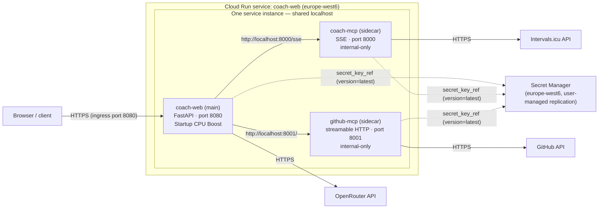

# coach-web — OpenTofu GCP Foundation (europe-west6)

Infrastructure-as-Code for the Phase 2 Serverless Cloud Migration (Sprint 08,
issues #64 + #66). Provisions the Swiss regional foundation: the full
multi-container Cloud Run service (coach-web + coach-mcp + github-mcp
sidecars), the networking foundation, the Google Identity OIDC configuration
surface, keyless CI federation (Workload Identity Federation) and versioned,
locked remote state.

## Data residency (Swiss nLPD)

- Every regional resource is pinned to **`europe-west6` (Zürich)**. The region
  variable is guarded by a validation rule — a different region requires a
  conscious edit of `variables.tf`, never a silent override.
- Secret Manager secrets use **user-managed replication pinned to
  `europe-west6`** — automatic replication would distribute secret material
  across Google-managed regions, which is unacceptable for nLPD-scoped
  credentials.
- The Workload Identity **pool and provider are global Google resources by
  design**; they hold no personal data (issue #64, AC2). All data-bearing
  resources (Cloud Run service, secrets, VPC/subnet, state bucket) live in
  `europe-west6`.
- Biometric/health data (Intervals.icu) never leaves `europe-west6`.

## Module layout

```
infra/
├── main.tf                  # Root: API enablement + module wiring
├── variables.tf             # Strongly typed inputs (region pinned to europe-west6)
├── outputs.tf               # Auditable outputs (URLs, identities, secret names, WIF principals)
├── versions.tf              # OpenTofu >= 1.6, google provider ~> 5.30
├── providers.tf             # google provider (ADC locally / WIF in CI from #67)
├── backend.tf               # GCS remote state (europe-west6, versioned + locked)
├── terraform.tfvars.example # Placeholder values — never commit terraform.tfvars
├── bootstrap/               # One-shot config that creates the state bucket
│   ├── main.tf              #   GCS bucket: versioning, UBLA, PAP enforced
│   ├── variables.tf
│   ├── outputs.tf
│   ├── providers.tf
│   ├── versions.tf
│   └── terraform.tfvars.example
└── modules/
    ├── cloud-run/           # Multi-container service (issue #66): coach-web +
    │                        # coach-mcp + github-mcp, Secret Manager secrets with
    │                        # per-secret IAM, Startup CPU Boost, scale-to-zero,
    │                        # startup probes, invocation IAM
    ├── networking/          # Custom-mode VPC + europe-west6 subnet (Private
    │                        # Google Access) — optional direct VPC egress
    ├── oidc/                # Google Identity OIDC config surface (client ID,
    │                        # issuer) — whitelist enforcement is #65
    └── wif/                 # WIF pool + GitHub OIDC provider (repo-scoped
                             # attribute condition) + least-privilege deployer SA
```

## Multi-container topology (issue #66, AC1)

One Cloud Run service, three containers. Cloud Run's sidecar pattern gives all
containers of an instance a **shared network namespace**: the Docker DNS names
of the local compose topology (`docker-compose.yml`, issue #63) become
`localhost` URLs. Only the **first** container (`coach-web`) terminates
ingress; sidecar ports are internal-only (AC5).



| Container | Image (variable, pinned tag) | Port | Role |
| --- | --- | --- | --- |
| `coach-web` (main) | `coach_web_image` → `ghcr.io/fpittelo/coach-web:dev` | 8080 (service port) | FastAPI app, agent loop, plan visualization |
| `coach-mcp` (sidecar) | `coach_mcp_image` → `ghcr.io/fpittelo/coach:dev` | 8000 (internal) | Intervals.icu MCP gateway (SSE) |
| `github-mcp` (sidecar) | `github_mcp_image` → `ghcr.io/github/github-mcp-server:v1.12.2` | 8001 (internal) | GitHub MCP server (streamable HTTP) |

- **Startup CPU Boost** is enabled on the main container (ADR-05) to keep
  cold starts inside the <3.5s budget even from scale-to-zero.
- **Startup probes** mirror the compose healthchecks: `GET /health` (coach-web),
  `GET /sse` (coach-mcp), TCP socket (github-mcp — the official image has no
  plain HTTP health endpoint; compose used a binary `--version` check).
- **Resources** (defaults, tunable via variables): coach-web 1 vCPU / 512Mi,
  coach-mcp 0.5 vCPU / 256Mi, github-mcp 0.25 vCPU / 256Mi — ~1.75 vCPU and
  1 GiB per instance, keeping scale-to-zero at $0 fixed cost (ADR-04).
- **Scaling**: `min_instance_count = 0`, `max_instance_count = 2`.
- **Images** (AC3): every image variable must carry an explicit tag or digest;
  floating `:latest` is rejected by variable validation. The deploy workflow
  (#67) wires environment-specific tags (`dev` / `qa` / `prod` / sha).

### Private GHCR images — deployment prerequisite

The `ghcr.io/fpittelo/*` packages are **private** (architect triage on #66:
anonymous pull returns `UNAUTHORIZED`). Cloud Run can pull **only** from
Google-hosted registries (Artifact Registry) or public registries — it has no
`imagePullSecrets` mechanism for external private registries. At the gated
apply moment, resolve via one of:

1. **Mirror to Artifact Registry `europe-west6`** (preferred — keeps image
   distribution in-region and uses the runtime SA's `artifactregistry.reader`),
   then set `coach_web_image` / `coach_mcp_image` to the AR URIs; or
2. Make the GHCR packages public (acceptable only if the images contain no
   sensitive material) and keep the GHCR references.

`github-mcp-server` is pulled from the public `ghcr.io/github/` registry and
is unaffected. Coordination with #67 (keyless CI/CD) is required either way.

## Secret Manager (issue #66, AC4)

IaC manages **secret metadata, replication and IAM only** — secret **versions
are populated out-of-band**, so no secret material ever reaches IaC or state.

| Secret (default ID) | Purpose | Consumed by (env name) |
| --- | --- | --- |
| `openrouter-api-key` | OpenRouter API key (coach agent LLM) | coach-web → `OPENROUTER_API_KEY` |
| `intervals-api-key` | Intervals.icu API key | coach-mcp → `INTERVALS_API_KEY` |
| `github-token` | GitHub PAT (training plan issues + MCP) | coach-web → `GITHUB_TOKEN`; github-mcp → `GITHUB_PERSONAL_ACCESS_TOKEN` |

### Population procedure (out-of-band, after the first `tofu apply`)

```bash
# 1. Create the secret resources + per-secret IAM (metadata only — no values):
cd infra && tofu apply

# 2. Populate versions (values never pass through IaC or state):
gcloud secrets versions add openrouter-api-key --data-file=- <<< "sk-or-..."     # project: <your-project>
gcloud secrets versions add intervals-api-key --data-file=- <<< "your-intervals-key"
gcloud secrets versions add github-token      --data-file=- <<< "ghp_..."

# 3. Deploy / redeploy the service so revisions resolve the secrets:
tofu apply   # or the #67 deploy workflow
```

- Cloud Run resolves `version = "latest"` at instance start; pin an integer
  version in `modules/cloud-run/main.tf` for strict deploy reproducibility
  once a rotation cadence is established.
- Rotation = step 2 + a service redeploy; the secret resource itself never
  changes.
- The first deployment **requires** each secret to already carry a version —
  run step 2 before the first service-creating apply (or apply twice).

## Pending-deployment validation (AC2 / AC6)

`tofu validate` proves the spec is syntactically and type correct, but two
acceptance criteria are **deferred to the gated apply moment** (procedural
gate below) and will be audited in issue #68:

- **AC2 (cold start < 3.5s, measured):** Startup CPU Boost is enabled in the
  spec, but the measurement requires a live service. Measure at first deploy
  (e.g. `gcloud run services describe` + request-timing a scale-from-zero
  request) and record the result in #68.
- **AC6 (`tofu plan` / `tofu apply` deploys the service):** no plan/apply has
  run against real GCP yet — this issue deliberately performs no `gcloud auth`
  and no live plan/apply. Exercise at the gated apply moment.

## Remote state & bootstrap (AC3)

State lives in a GCS bucket in `europe-west6` with object **versioning**
(state history) and the GCS backend's native **state locking**. The bucket
cannot create itself, so a tiny separate configuration with a **local backend**
bootstraps it once:

```bash
# 1. Authenticate as yourself (no service account keys — AC6)
gcloud auth application-default login

# 2. Create the state bucket (one-time)
cd infra/bootstrap
cp terraform.tfvars.example terraform.tfvars   # set project_id
tofu init
tofu plan          # review: one regional bucket
tofu apply         # procedural gate: see "Apply policy" below

# 3. Switch the root module to remote state
cd ..
tofu init          # configures the GCS backend from backend.tf
```

The bucket name in `backend.tf` must match `state_bucket_name` in
`infra/bootstrap/variables.tf` (backend blocks cannot use variables). Defaults
are kept in sync: `fpittelo-coach-web-tofu-state-europe-west6`.

## Running `tofu plan` locally

```bash
cd infra
gcloud auth application-default login              # if not already authenticated
tofu init                                          # remote backend + providers
cp terraform.tfvars.example terraform.tfvars       # set project_id (once)
tofu plan -out=tfplan                              # auditable diff (AC5)
tofu show tfplan                                   # human-readable review
```

`tofu plan` performs no writes and is safe to run at any time. The resulting
plan diff is attached to the corresponding issue/PR as the audit record.

## Apply policy (AC5 — procedural gate)

**`tofu apply` is never wired into CI.** Applies are executed manually by
@devops **only after an explicit approval comment from @fpittelo** on the
corresponding issue or promotion PR. This gate is procedural by design: the
audit trail lives in GitHub (approval comment → apply → plan diff attached to
the issue), not in pipeline YAML.

## Ingress posture (carried review item #2 from #64)

The service uses `INGRESS_TRAFFIC_ALL` plus a `roles/run.invoker` binding for
`allUsers` on this single service. This open edge posture is **only acceptable
because ADR-04 makes the application-level Google OIDC whitelist (issue #65)
the access-control boundary**: the edge passes traffic through, the app
validates Google ID tokens against the configured client ID
(`GOOGLE_OIDC_CLIENT_ID` / `GOOGLE_OIDC_ISSUER` env) and enforces the
whitelist. This assumption is documented inline in
`modules/cloud-run/main.tf`; if #65's posture changes, the edge posture must
be revisited in the same change.

## Workload Identity Federation (AC6 — keyless, ADR-06)

- Pool `github-actions-pool` + provider `github-actions-provider` trust
  `https://token.actions.githubusercontent.com`.
- The **attribute condition** restricts federation to
  `assertion.repository == "fpittelo/coach-web"` — tokens from any other
  repository are rejected outright.
- The deployer service account is impersonated via a **repo-scoped
  `principalSet`** bound on the SA itself (not project-wide).
- **No service account keys exist anywhere** — not in code, not in state.
  GitHub Actions consumes this in issue #67 (`deploy.yaml`), using the
  outputs `wif_provider_name` and `deployer_sa_email`.

## IAM — least-privilege justifications

| Principal | Role | Scope | Why |
| --- | --- | --- | --- |
| `gha-coach-web-deployer` (CI) | `roles/run.admin` | project | Create/update the Cloud Run service during deploys (#67) |
| `gha-coach-web-deployer` (CI) | `roles/iam.serviceAccountUser` | project | Set the runtime SA on the service it deploys |
| `coach-web-runtime` | `roles/logging.logWriter` | project | Write application logs |
| `coach-web-runtime` | `roles/monitoring.metricWriter` | project | Report container metrics |
| `coach-web-runtime` | `roles/cloudtrace.agent` | project | Export traces |
| `coach-web-runtime` | `roles/secretmanager.secretAccessor` | **per secret** (3 bindings) | Read exactly the stack's secrets (carried review item #1: no project-level secret access) |
| `allUsers` | `roles/run.invoker` | single service | ADR-04: edge accepts traffic, app enforces the Google OIDC whitelist (#65) |

Deliberately **not** granted: `roles/owner`, any `roles/*` wildcard,
project-level `secretmanager.secretAccessor` (replaced by per-secret bindings
in #66), `secretmanager.secretAccessor` on the CI deployer (it never reads
secret values), Artifact Registry roles (images ship from ghcr.io; an AR
mirror would add `artifactregistry.reader` for the runtime SA only).

## CI gates (AC4, AC7)

`.github/workflows/ci.yaml` runs, with zero-warning tolerance:

1. `tofu fmt -check -recursive infra/`
2. `tofu init -backend=false` + `tofu validate` in `infra/`
3. `tofu init -backend=false` + `tofu validate` in `infra/bootstrap/`

`-backend=false` because CI holds no GCP credentials in this issue; WIF-based
CI authentication (and any plan/apply automation) is issue #67. No CI changes
were needed for #66: the existing `opentofu` job validates `infra/`
recursively and picks up the extended module automatically.

## Intentionally out of scope (tracked elsewhere)

| Concern | Issue |
| --- | --- |
| Application-level Google OIDC whitelist | #65 |
| GitHub Actions WIF authentication in `deploy.yaml` | #67 |
| Cold-start measurement + live apply audit | #68 |
| `deletion_protection` (requires google provider 6.x upgrade — unsupported by 5.45.2, re-verified in #66) | tracked for a provider-upgrade change |
